# 建立仓库

我跟同学A想合作写一个小工具库，然后选了了`Git`作为版本控制系统, `Github`作为托管服务器.

第一步首先是建立一个`Git`仓库, 哦不对, 是先下载`Git`工具, `Git`是全平台的工具, 基本所有操作系统都支持. 我们直接百度找到官网从里面下载就可以了. 

然后建立`Git`仓库, 我们怎么建立仓库呢? 有两种方法, 一种是在`Github`上创建一个新仓库.


登录`Github`后, 它长这样, 点击左边那个`New`来创建一个新的仓库.

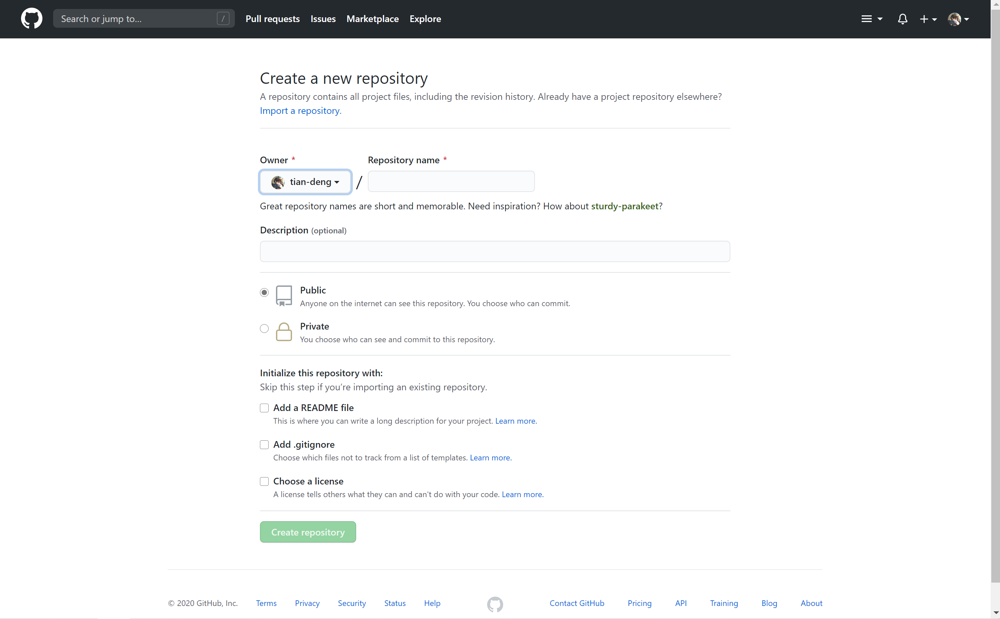

如果想让 `Github` 帮我们初始化仓库, 那么就选择Add a README file选项. README file一般是对当前仓库所做的事情的一个简介. 相当于使用说明书.

让`Github`帮我们初始化, 就相当于运行了如下命令:

```bash
git init
git add README.md
git commit -m "Initial commit"
git remote add origin git@github.com:tian-deng/Cooperation.git //先不管这行
```

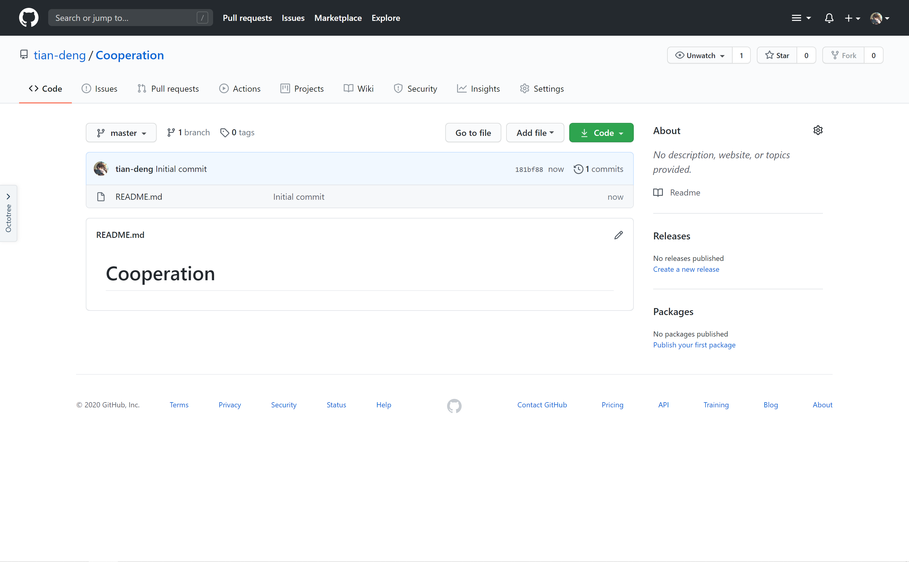

这样就算完成了. 还有一种方法就是在本地用`git init`命令创建, 然后回头`push`到`Github`托管服务器上就ok.

我们要合作写项目, 那肯定要上传点东西到`Github`服务器, 服务器不能随便让别人直接上传到我们的项目对吧?服务器一般用的都是`SSH`协议来验证用户的, 所以需要先添加`SSH key`, 打开`cmd`, 在本地用`ssh-keygen`命令来创建公钥和密钥.一路回车就行

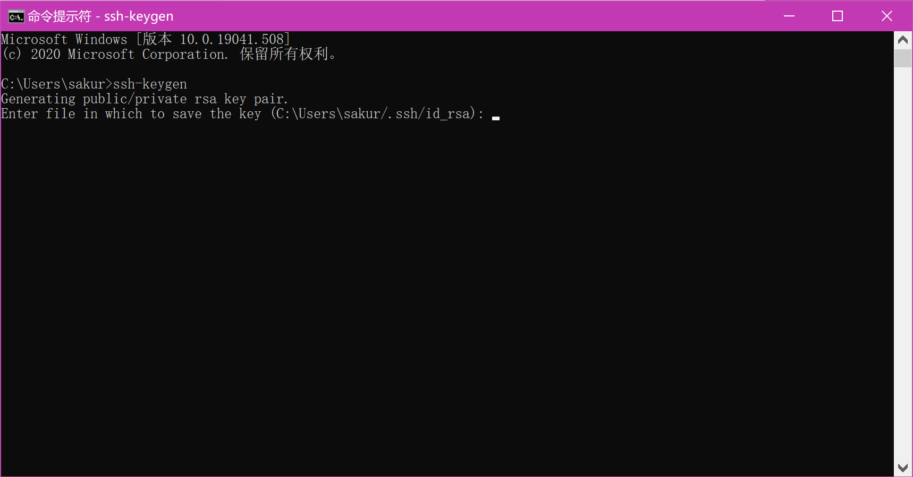

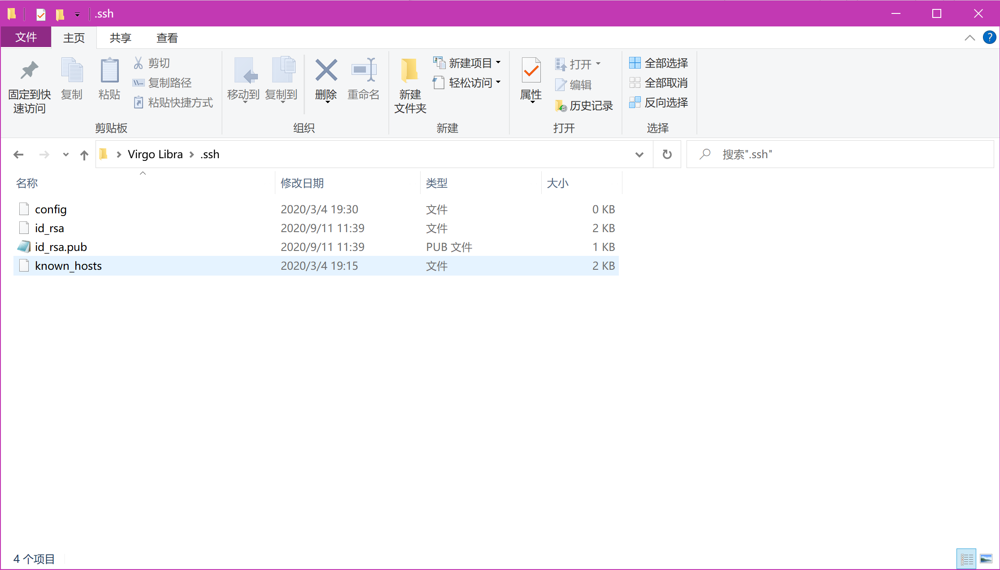

然后复制`id_rsa.pub`的内容

回到我们的网页, 用户头像->settings->`ssh and gpg keys`

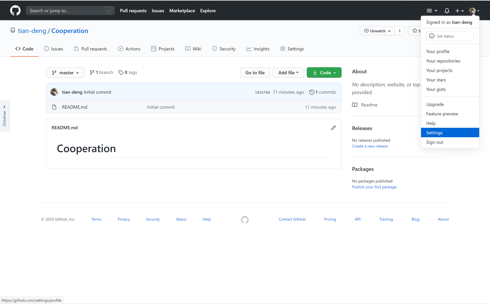

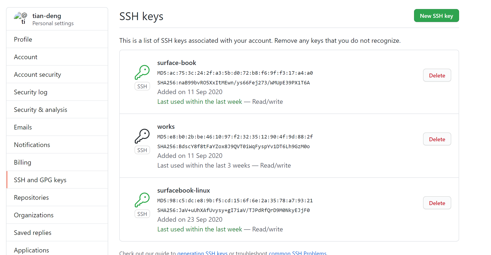

在这里来添加我们的公钥.

然后就可以上传到我们的`Github`仓库了.

现在, 一切前序工作都准备完成了, 我们来开始合作敲代码吧~

# 合作

回到我们的`Github`仓库, 点击`Code`->`SSH`来用`SSH`协议将我们的仓库拉到本地, 复制这串链接

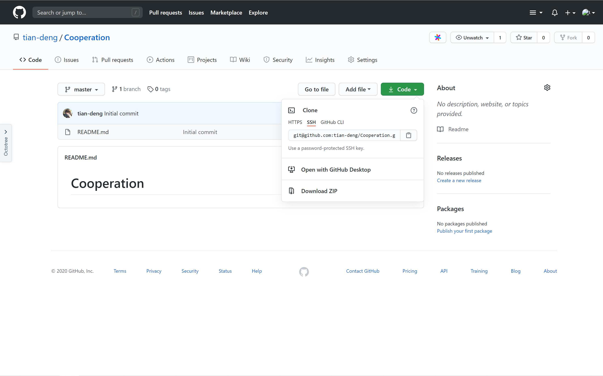

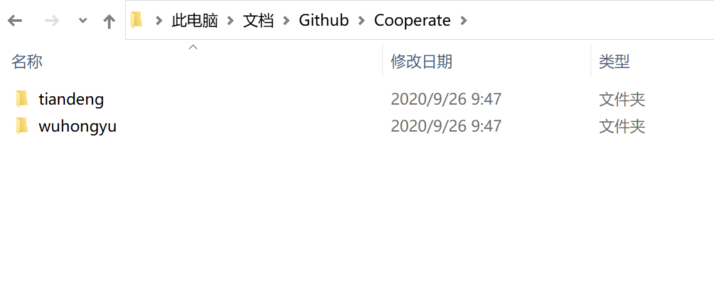

这里我用两个文件夹来表示我跟`david`. 首先`bob`把代码从远程复制到本地

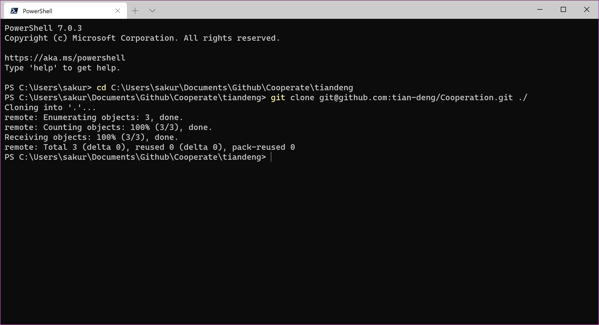

`git clone`命令相当于把代码拷贝了一份, 就跟你直接`download`是一个效果.

同样的, `david`也`clone`了一份.

以下是`bob`的操作:

## `bob`

### 提交代码

`bob`现在想给我们的项目先增加两个功能, 一个功能是排序, 另一个功能是二分查找.

1. `bob`创建目录`src`用来放源代码.

2. `bob`创建文件`utils.h`用来规定函数签名.

3. `utils.h`内容如下

   ```c
   #ifndef UTILS
   #define UTILS
   void sort(int[] arrays, int length);
   #endif
   ```

现在回到命令行工具, 我们看看仓库的创建.


相信大部分人英语都是比我好的, 翻译过来就是

> 当前在主分支上
>
> 主分支对比`origin/master`已经是最新的了
>
> 没有跟踪的文件:
>
> ​		`src/`
>
> 没有添加和提交但是存在没有跟踪的文件, 使用"git add" 来跟踪.

我们知道我们现在所处的分支是`master`, 那么这个`origin/master`又是个什么东西?

`origin`是我们远程服务器的一个别名.我们是从`Github`服务器我们的仓库上克隆的代码, 所以这个`origin`就是`git@github.com:tian-deng/Cooperation.git`. 

```bash 
git remote add origin git@github.com:tian-deng/Cooperation.git
```

这个命令就是用来在本地和远程服务器的仓库之间建立联系的. 这样 `Git` `push` 或者说 `上传` 代码的时候就知道上传到哪个地方了, 解决了上面一开始的问题.

此时查看 `git log`, 可以发现 `origin/master` 和 `origin/HEAD` 也存在, 意思是远程的分支和远程的最新提交在哪个地方.

我们可以使用 `git remote get-url`来查看某个远程服务器别名的实际地址.

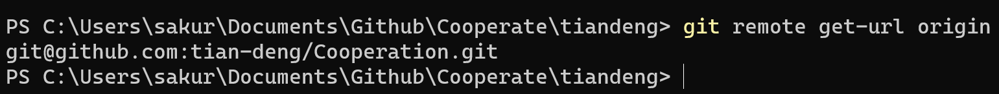

好了继续解释 `git status` 的信息.

接下来是 `untracked files`. 未追踪的文件就是说是我们在工作区新添加的文件, 工作区就是我们目前文件夹中的所有内容. 在他的状态还是未追踪的时候, 我们对这个 `Git` 仓库进行的大部分操作和命令, 都不会影响到未追踪文件, 包括但不限于`git reset`, `git checkout`, `git commit`, `git push`. 这些操作都不会对未追踪文件有任何的影响.

未追踪文件就是个**局外人**, 但我们的`src`文件夹显然不是局外人, 所以我们使用`git add`命令来让它加入到我们的圈子, 加入到我们的`Git`仓库中.

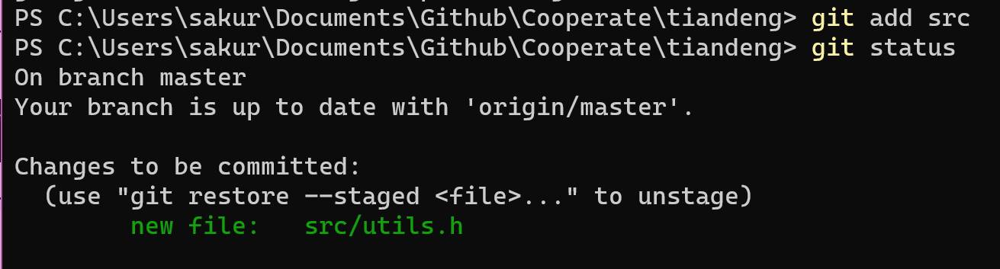

好了, 它不是一个局外人了. 它已经融入我们的圈子, 并且随时随地被我们监控着, 影响着.

现在, 文件从未追踪状态进入到了暂存区, 进入到暂存区开始, 它的一言一行都会被我们观察到了. 我们现在改变`utils.h`的内容.

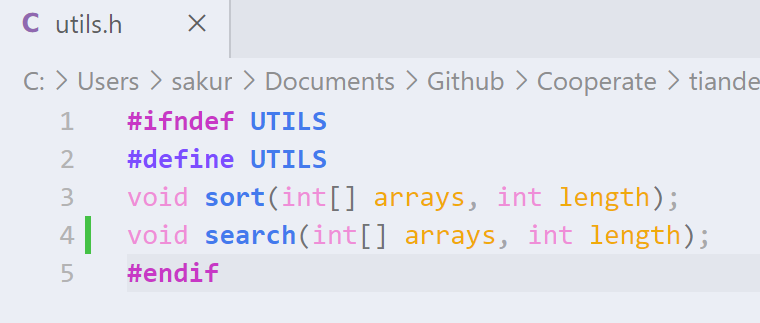

如图, 增加了`search`签名. 然后再看看状态.

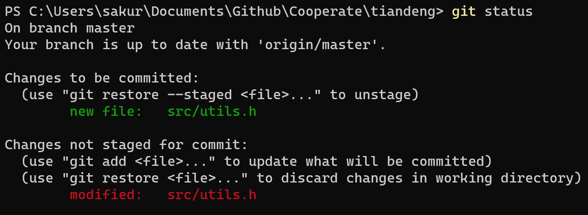

我们改变文件也被追踪到了? 那么现在我想看看我改变了什么.

使用`git diff`命令

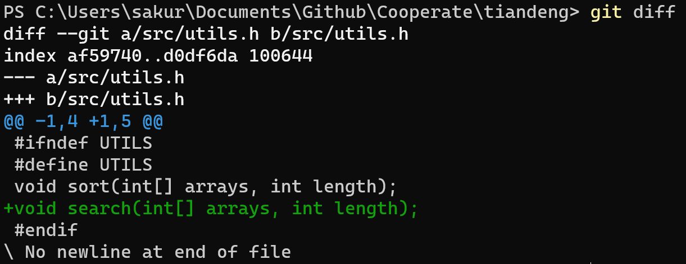

显示我们增加了 `search` 函数的签名.

`git diff`不加任何参数默认对比的是暂存区与工作区之间的区别(不包括未追踪文件这个**局外人**).

这就是为什么会有暂存区, 暂存区极大的拓展了`Git`对文件追踪的能力, 它可以知道我们改变了什么, 删除了什么, 移动了什么, 而不需要在提交后才能与历史版本进行对比, 它可以追踪我们每次暂存区的变化, 相比较对版本库的`diff`, 对暂存区的`diff`属于一种更细粒度, 更精细的对比.

如果我们想对比暂存区与版本库的区别呢?

`git diff --cached` 或者 `git diff --staged`

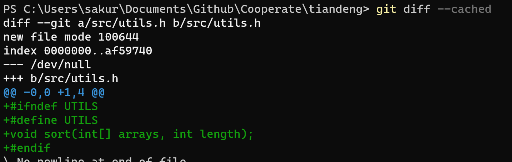

是不是这里没有我们工作区的修改? 因为我们对工作区的修改还没添加到暂存区. 

现在我们先使用`git commit`进行提交.

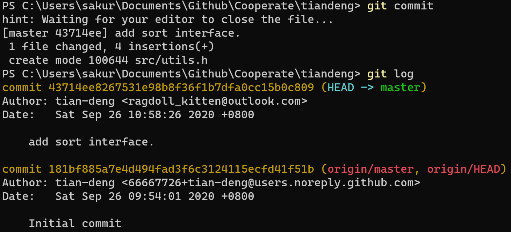

使用 `git log` 看到的是版本库的记录.

我们可以看到除了`Github`帮我们初始化的提交以外, 又多了一笔新的提交, 同时, 也体现出了远程服务器上的代码还处在第一个提交的状态.

然后我们看看仓库的状态.

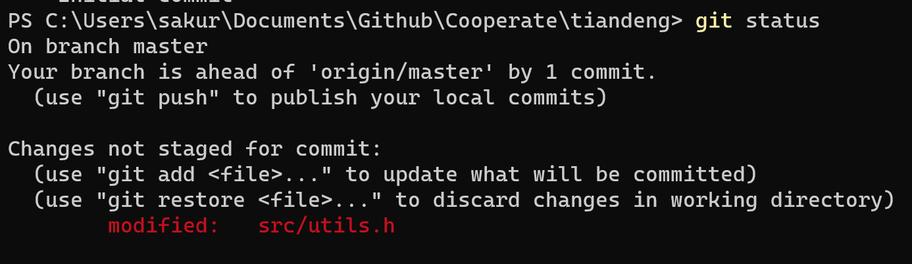

可以看到, 提示我们领先了远程服务器一个提交, 提示我们使用`git push`命令来上传代码. 同时还有一个工作区的修改没有添加到暂存区. 我们将其也一并提交了吧~

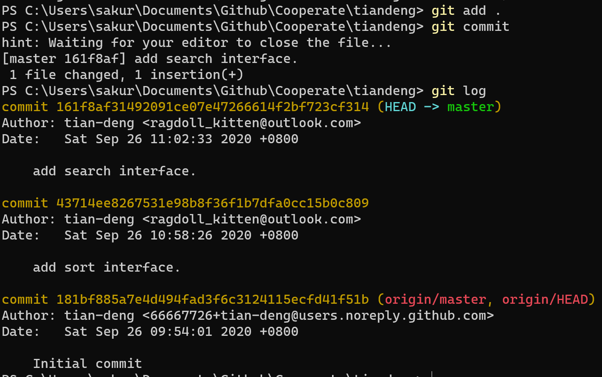

现在我们领先了两笔提交了~

然后我们使用`git push origin master`将我们的代码上传到`origin`服务器的`master`分支上.

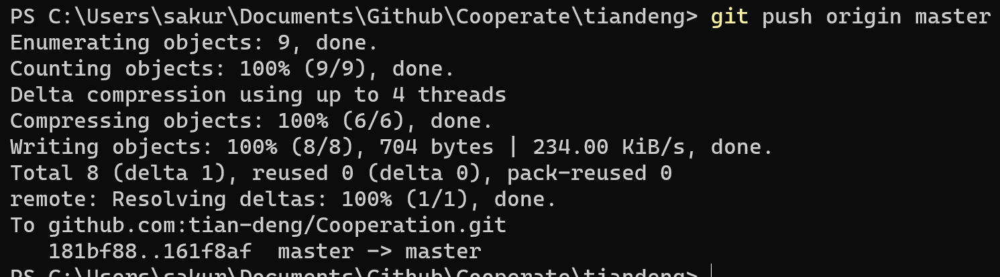

这样就上传完成了~然后我们看看我们的`Github`仓库.

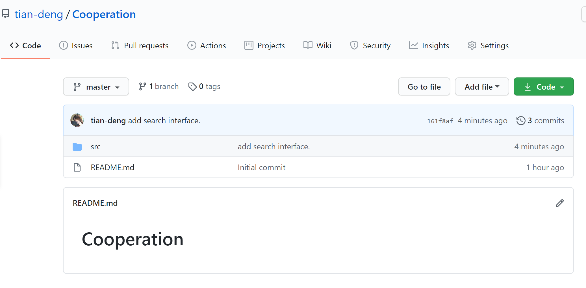

可以看到`4min`前有更新, 然后有了3笔提交.

到这里就告一段落了~

总之, 我们`push`或`upload`到远程服务器上的只有我们`commit`后的部分, 也就是说只有当前分支版本库中的东西会被上传到远程服务器中, 暂存区, 工作区都是不会被上传的.

### 处理冲突

这时我突然发现我两个函数签名写错了好吧?但我又不想重新用提交来修复我这两个签名, 那么应该怎么做?

`git reset HEAD^^` 来回退两个提交, 这就相当于同时撤销了我的`commit`操作和`add`操作, 但是不修改我们目前工作区的文件内容.

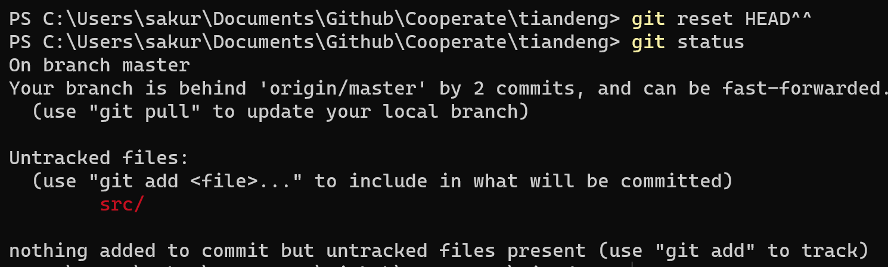

可以看到我们回到了第一笔提交. 但是我们工作区的文件没有被回退, 在这个基础上修复一下函数签名.

```c
#ifndef UTILS
#define UTILS
void sort(int arrays[], int length);
void search(int arrays[], int length);
#endif
```

然后重新 `add commit`, 把之前的两笔合并到一起吧.

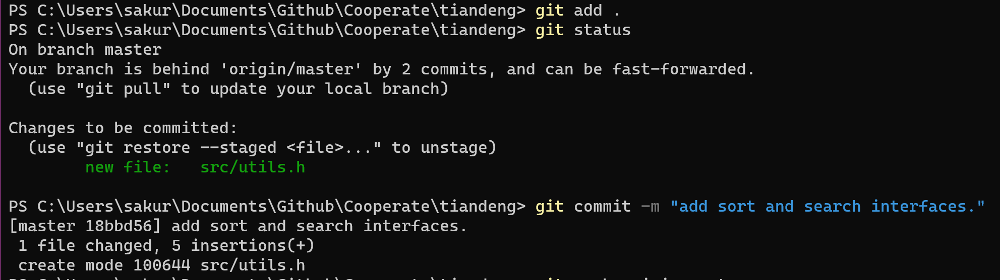

然后我们上传代码.

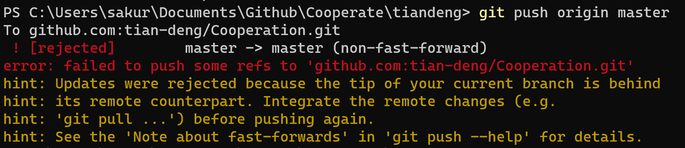

提示我们远程分支要比我们本地的分支领先(本地两个提交, 远程有三个, 因为我们把两笔提交合并到一起了), 提示我们要用 `git pull` 更新代码. 


提示我们有冲突, 需要我们处理好冲突再提交.

那么我们再打开我们的`utils.h`看看.

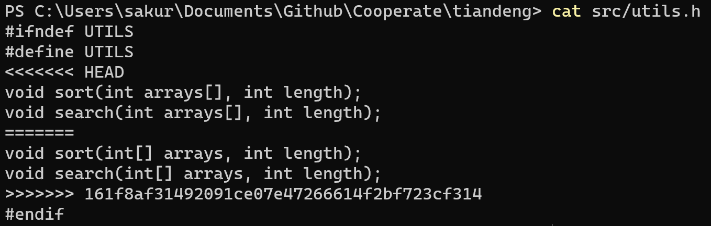

发现多了几行提示? `<<<`到`===`的部分表示我们本地的代码, `===`到`>>>`的部分表示我们要`merge`的代码, 我们只需要保留正确的就可以了. 同时也需要删掉`Git`给我们的那些提示部分(`<<<`行,`===`行和`>>>`这三行也需要删掉).

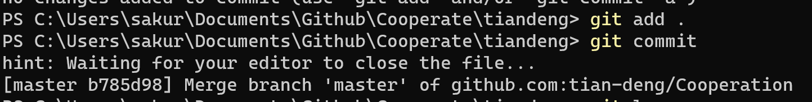

处理完冲突后我们重新`add commit`, 然后`git log`看看.

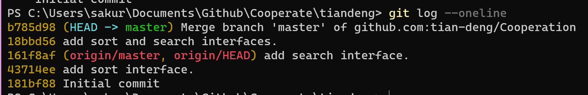

我们本来只是想让提交变少一点, 现在是不是多此一举啊.

有解决方法么? 有, 就是在`git push`的时候添加`--force`参数, 这样就完全是用本地的版本库去覆盖服务器的版本库. 这在我们自己小范围几个人做项目的时候没问题, 但是如果人多了起来, 突然发现远程版本库怎么回退了? 那中间如果夹杂了其他人的提交怎么办?他们的工作是不是也浪费掉了?

所以一般是不会允许`--force`操作的, 也就是说一般是不允许回退到服务器之前的版本中的, 回退服务器中的版本是需要一定权限的. 如果自己在代码注释里骂了老板骂了公司, 没上传就晴天, 如果上传了, 就期待着老板是自己亲戚吧~ 

自己的回退一般在`gerrit`里代码审查是无法通过的. 所以我们就带着我们的错误记录一起上传到服务器吧~

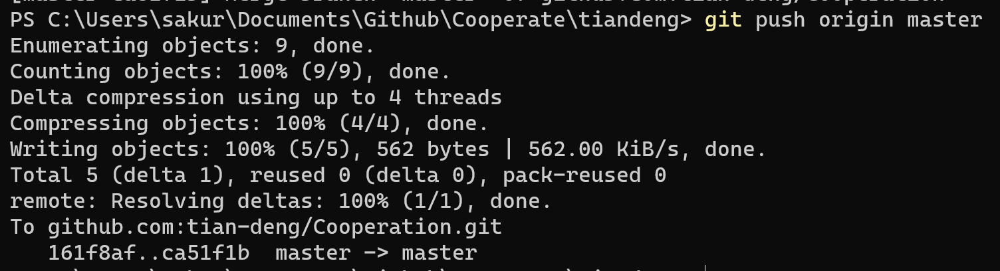

好了, 现在`bob`把`sort`函数的实现交给`david`去做了, 此时`david`更新了代码, 快排如火如荼的进行着......

然后`bob`开始写`search`二分查找的实现(此时`david`在查快排是什么).

但是二分查找法是建立在数组有序的情况下的, 所以`bob`就先简单实现了一个冒泡算法来应付一下排序.

这时, `bob`发现他的函数签名又错了, 忘了给二分查找加一个`target`, 所以`bob`又改了改上传了...然后又又又发现函数应该返回一个索引而不是`void`, 然后又又又改了改上传了.......最后`bob`生气了, 直接回退到最初版本把函数签名改对, 然后`--force`了..................

### 解放

最终`utils.c`文件中代码如下.

```c
#include "utils.h"
void sort(int arrays[], int length)
{
    for (int i = 0; i < length; i++) {
        for (int j = 0; j < length; j++) {
            if (arrays[i] < arrays[j]) {
                int temp = arrays[i];
                arrays[i] = arrays[j];
                arrays[j] = temp;
            }
        }
    }
}
int search(int arrays[], int length, int target) {
    int left = 0, right = length - 1, mid;
    while (left <= right) {
        mid = (left + right) / 2;
        if (target < arrays[mid]) {
            right = mid - 1;
        }
        else if (target > arrays[mid]) {
            left = mid + 1;
        }
        else {
            return mid;
        }
    }
    return -1;
}
```

随后他 `add commit push` 三连, `bob`解放了...

等等...`bob` `push`上传代码出问题了

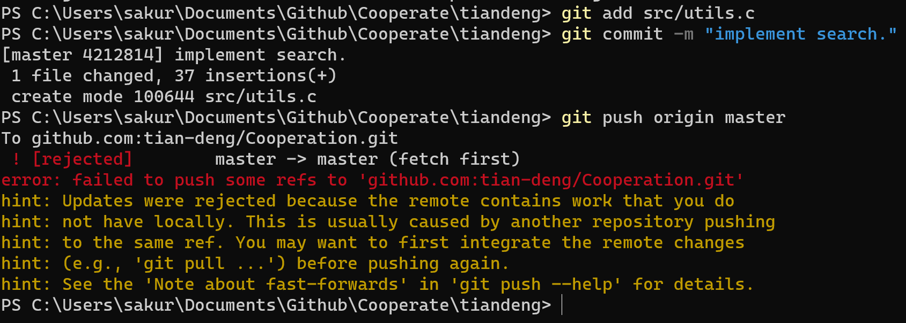

接下来是 `david` 在 `bob` 编写代码的同时所做的操作.

## `david`

`david`明显就比`bob`厉害多了, 他修改代码前先创建了一个`work`分支.

`git branch work`, 然后使用`git checkout work`切换到了该分支. 然后才开始修改代码......

`git checkout -b work`是这两条命令的结合版.

### 对比代码

创建好分支后他好奇的看了看`git log`

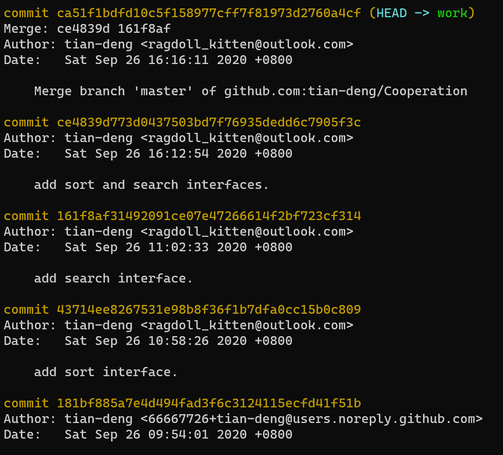

怎么写个接口还能有这么多提交的? `bob`是`sb`吗?

然后他想看看为什么, 于是输入了如下命令.

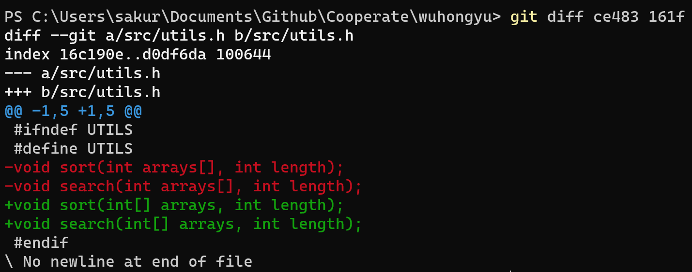

不禁默默的在头文件加了个注释.

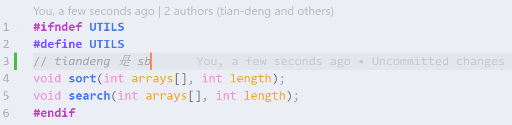

然后开始了他的代码之旅......

```c
#include "utils.h"
void swap(int *p, int *q) {
    int temp;
    temp = *p;
    *p = *q;
    *q = temp;
}
void quick_sort(int arrays[], int low, int high) {
    if (low >= high) {
        return;
    }
    int i = low;
    int j = high;
    int key = arrays[low];

    while (low < high) {
        while (low < high && key <= arrays[high])
            --high;
        swap(&arrays[low], &arrays[high]);
        while (low < high && key >= arrays[low])
            ++low;
        swap(&arrays[low], &arrays[high]);
    }
    quick_sort(arrays, i, low - 1);
    quick_sort(arrays, low + 1, j);
}
void sort(int arrays[], int length) {
    quick_sort(arrays, 0, length - 1);
}
```

搞定, 写完提交~

### 图形化`log`分析分支信息

然后`david`切换到主分支, 开始同步到最新的代码.

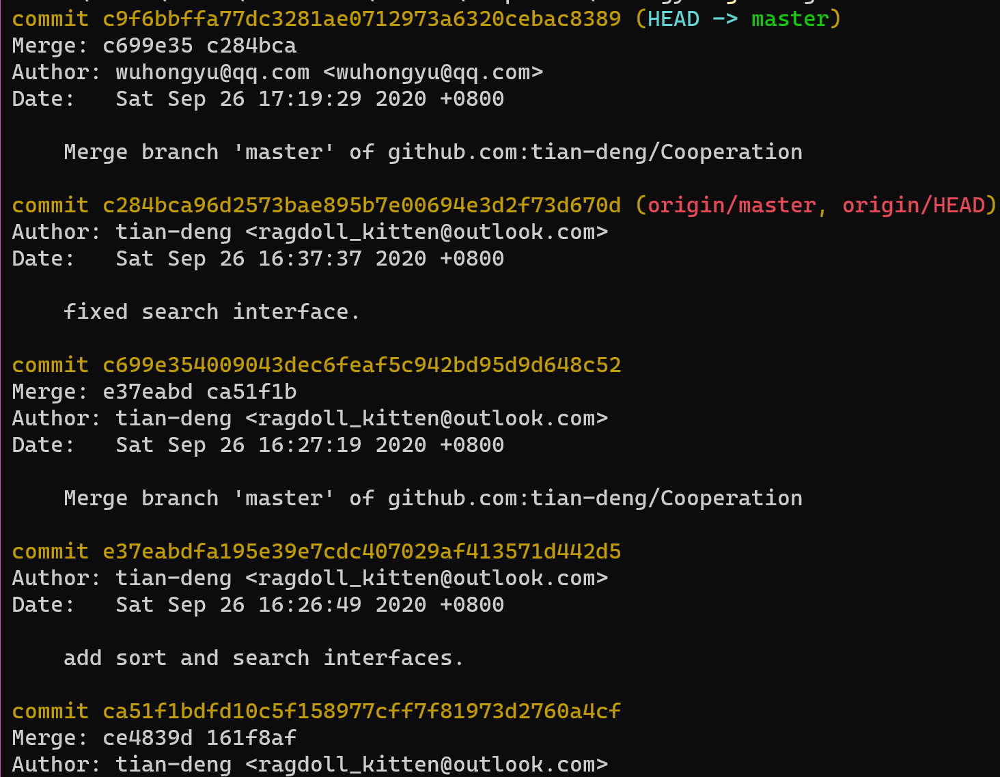

怎么回事, 一般来说同步代码后远程(`origin/master`和`origin/HEAD`)应该是最新的提交, 怎么不是最新的呢?

我们用更清楚的`git log`看看情况好吧, 看看`origin/master`到底是怎么回事.

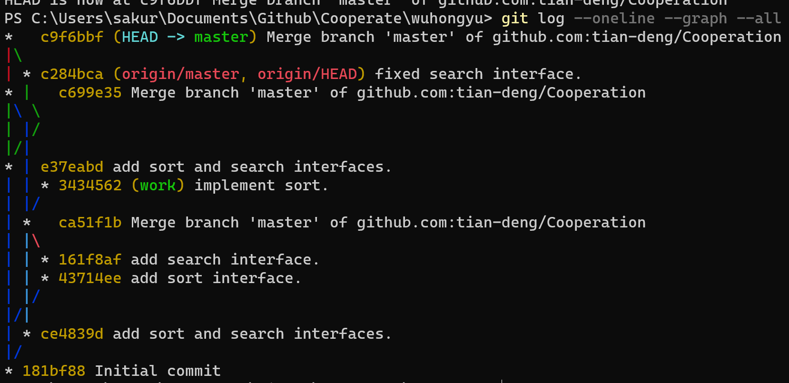

* `--oneline` :: 每个提交用一行表示, 类似于`--pretty=oneline`
* `--graph` :: 用图形化表示.
* `--all` :: 查看所有分支.

观察从起点到远程`HEAD`所在的点, 只有三笔提交.

我们目前所在的地方, 有5笔提交.

而我们work分支又是从`ca41f1b`这里开始分叉出去的.

为什么会这么乱?为什么远程又只有三笔提交?

原因就是`bob`这个`sb`强行进行提交, 以为可以瞒天过海.

但实际上他所有的操作, 都是有被记录下来的. 即使使用了`--force`, 也是有蛛丝马迹可以查看到他的`sb`操作的.

不过`david`宽宏大量好吧, 直接把本地主分支重制到远程服务器最新的.

`git reset c284bca --hard`

`--hard`表示不仅回滚版本库与暂存库(相当于撤销了`commit`和`add`), 同时还对`c284bca`版本库中的文件使用`git checkout -- files.....`覆盖了工作区. 等于同时撤销了版本库, 暂存库, 工作区.

然后我们回退到`origin/master`所在的分支看看.

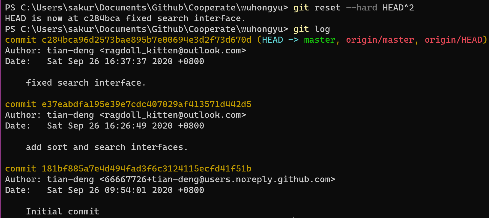

哦完美......

### 合并指定提交

`david`怎么把他的工作成果合并到主分支呢? 难道要对比着重写吗?

正常情况下使用

`git merge work` 可以将整个`work`分支合并到当前分支, 也就是当前干净的主分支.这里较于简单就不细说了. 处理冲突的方法上面也有提到. 

然而此时`david`那边的`work`分支又是没有回滚前的. 我们不想使用`merge`把整个分支`merge`过来好吧, 那样的话`bob`的昏头操作记录岂不是又回来了.

可不可以只挑`david`提交代码的那个合并过来?

使用`git cherry-pick`可以指定要合并的提交, 然后只合并需要的部分就可以了.

然后我们使用`git log work --oneline`就可以在不切换分支的情况下查看其他分支的`log`了

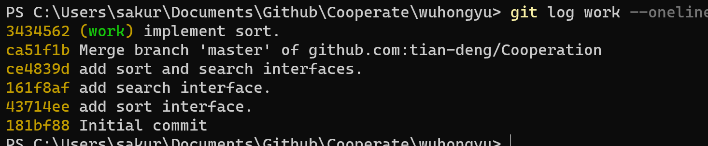

`git cherry-pick 3434562`

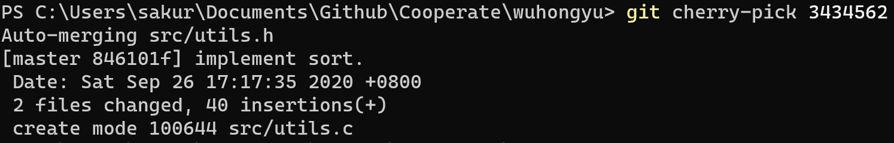

再看看`log`

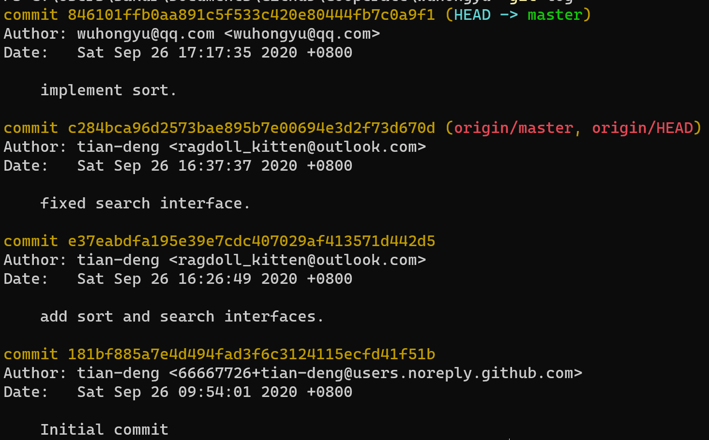

完美好吧, 干净整齐.

突然想起来, 刚才好像在一个文件里骂过`bob`, 怎么办呢.

`git reset --soft HEAD^`软回退到提交前, 软回退是只撤销`commit`, 不撤销`add`, 也不会把版本库或者暂存库的文件覆盖到工作区中.

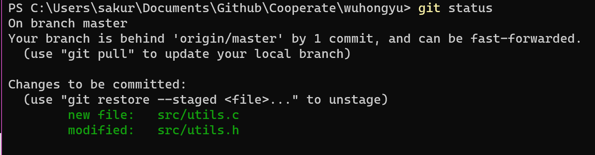

可以看到我们的暂存区也没有被回退, 省去我们重新添加`utils.c`文件了. 我们把那行骂`bob`的话删掉. 然后`add commit push`三连.

`git push origin master`

工作`over`

## `bob`

### 同步出错

回到`bob`这里, 再看看错误原因.


这里提示我们本地分支不是最新的版本, 需要先同步代码才可以. 因为`david`在我们提交代码前就已经把他的快排写完上传到服务器上了, 那我们同步一下试试.

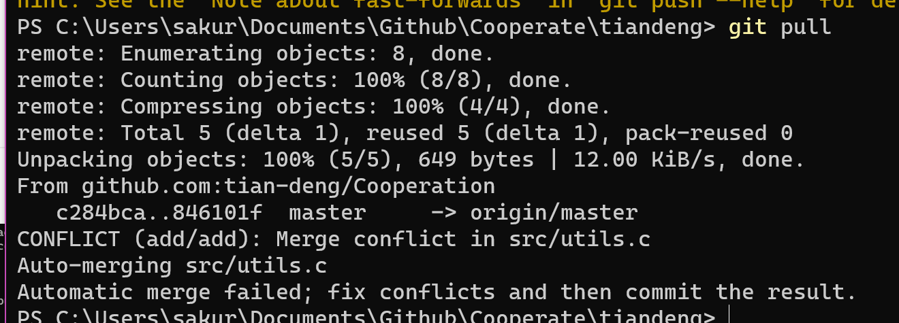

怎么又有冲突啊, `bob`崩溃了...

再看看状态.

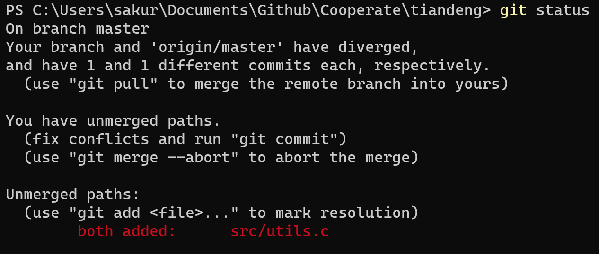

我们又有个冲突的文件`src/utils.c`, 这是因为`david`和`bob`都有修改文件, 合并的时候`Git`不知道该保留哪些部分.

这里说明一下, `git pull`相当于`git fetch`与`git merge origin/master`两个操作的结合版, 输入`git branch --all`查看所有分支.

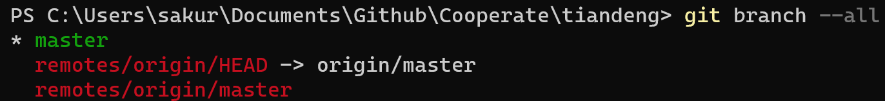

可以看到包括远程的分支也在.

也就是说`git pull`相当于把远程分支的代码拉下来, 然后再将它合并到当前的分支. 所以这里会提示你处理合并的冲突.

我们之前处理过冲突这种事情, 所以再次处理冲突问题应该是小菜一碟了. 但是处理冲突会产生`commit`提交, 同时也会在`git log --oneline --graph --all`出现一个表示分支合并的横线. 我们现在想主分支只有一条干净的直线, 不要有那些弯弯绕绕, 那应该怎么做呢?

### 嫁接

我们先`git merge --abort`撤销`merge`操作.

然后使用嫁接`git rebase`.

`git rebase origin/master`

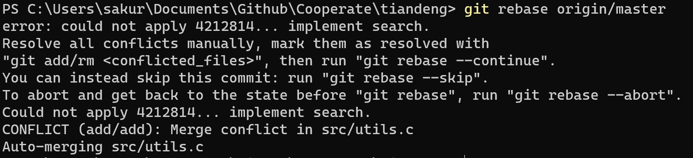

同样提示我们有冲突, 那这跟`git merge`有什么区别吗?我们先继续向下进行.

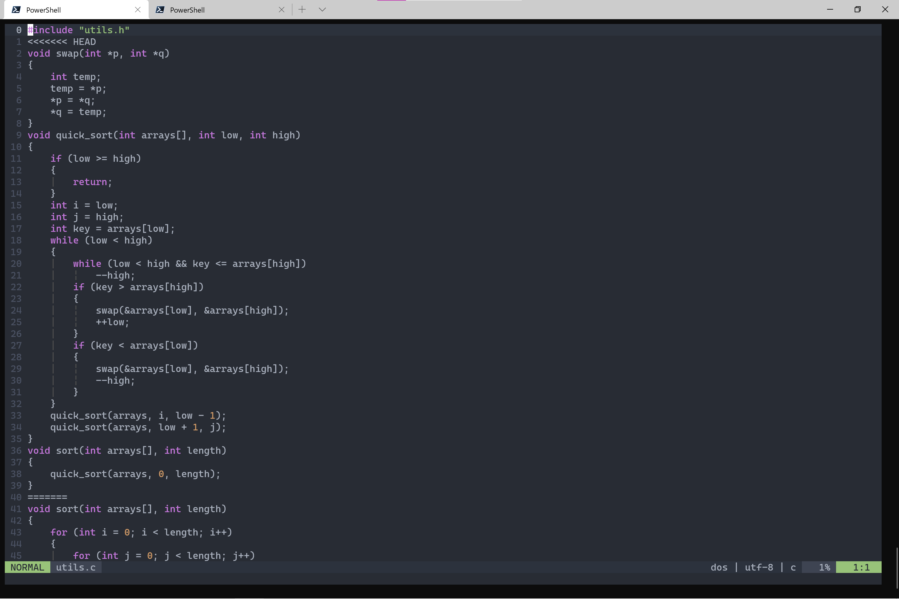

然后我们保留`david`更加高效的排序算法和`bob`的二分查找算法, 文件最终为这样

```c
#include "utils.h"
void swap(int *p, int *q) {
    int temp;
    temp = *p;
    *p = *q;
    *q = temp;
}
void quick_sort(int arrays[], int low, int high) {
    if (low >= high) {
        return;
    }
    int i = low;
    int j = high;
    int key = arrays[low];

    while (low < high) {
        while (low < high && key <= arrays[high]) --high;
        swap(&arrays[low], &arrays[high]);
        while (low < high && key >= arrays[low]) ++low;
        swap(&arrays[low], &arrays[high]);
    }
    quick_sort(arrays, i, low - 1);
    quick_sort(arrays, low + 1, j);
}
void sort(int arrays[], int length) {
    quick_sort(arrays, 0, length - 1);
}
int search(int arrays[], int length, int target) {
    int left = 0, right = length - 1, mid;
    while (left <= right) {
        mid = (left + right) / 2;
        if (target < arrays[mid]) {
            right = mid - 1;
        }
        else if (target > arrays[mid]) {
            left = mid + 1;
        }
        else {
            return mid;
        }
    }
    return -1;
}
```

完美~

搞定后首先`git add`, 然后`git rebase --continue`, 再来看看`git log`.


是不是很干净的一条直线?并且也没有多出来任何提交~

### 忽略文件

我们现在想写个函数测试一下我们的成果.

```c
#include <stdio.h>
#include "utils.h"

void print_array(int arrays[], int length) {
    printf("[ ");
    for (int i = 0; i < length; i++)
    {
        printf("%d ", arrays[i]);
    }
    printf("]\n");
}

int main() {
    int a[] = {2, 3, 1, 4, 6, 0, 3, 2, 13, 64, 23, 75, 43};
    sort(a, 13);
    print_array(a, 13);
    int target = 4;
    int index = search(a, 13, target);
    printf("num %d's index is: %d.\n", target, index + 1);
}
```

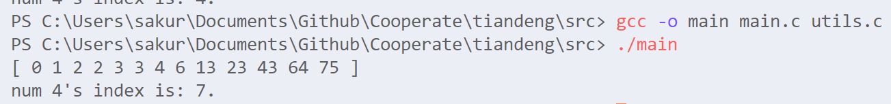

完美~

工作结束~

但我们需要上传我们的`main`函数和编译好的二进制文件到别人那里吗?并不需要吧. 但每次`git status`里不停的说存在未跟踪文件, 就很烦. 怎么办呢~

我们可以使用`.gitignore`文件来忽略掉我们不需要的东西, 甚至`.gitignore`文件本身.

在仓库目录创建`.gitignore`文件

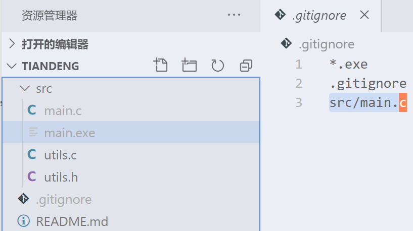

内容如图, 目前工作结果如图.

工作完成~

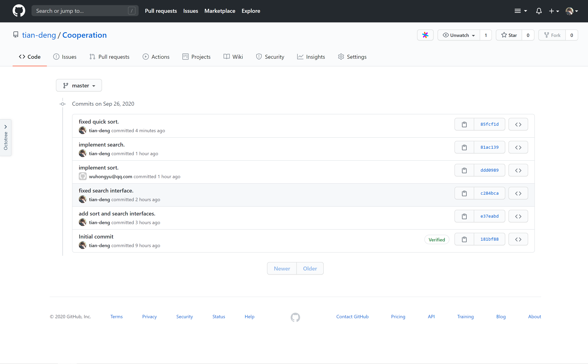

`Github`的最终成果.[仓库地址](https://github.com/tian-deng/Cooperation/commits/master)

到这里就告一段落了~你已经学会了`Git`的最常用的一些操作了!!!
