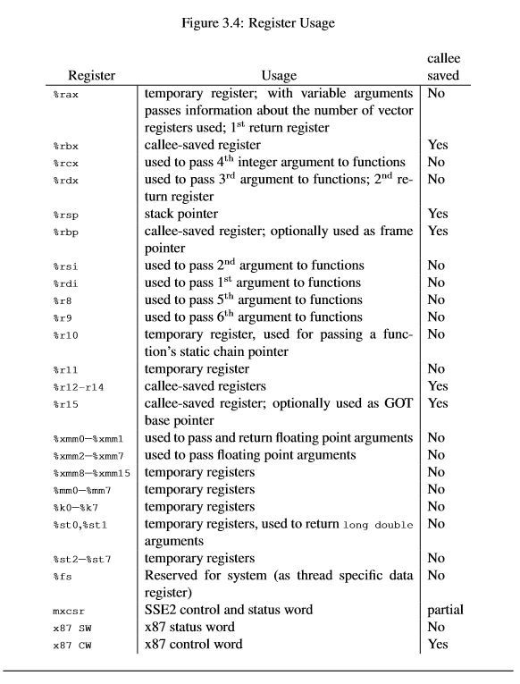
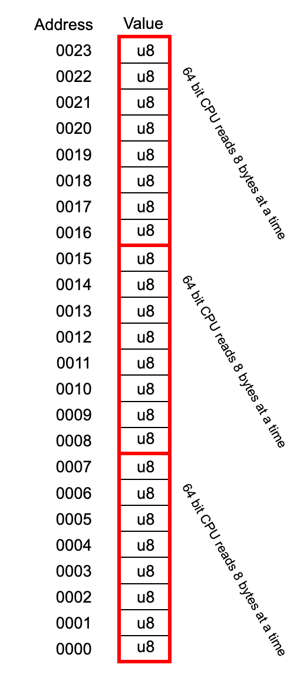
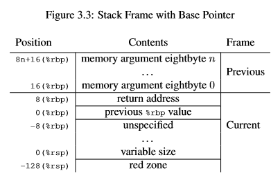

>  本译文译自 [Green Threads Explained in 200 Lines of Rust](https://cfsamson.gitbook.io/green-threads-explained-in-200-lines-of-rust/)

---


# 介绍

这本书目标是通过我们自己编写实现的一个简单可用的绿色线程代码, 来解释绿色线程.

> 所有代码可以在该 [Git仓库](https://github.com/cfsamson/example-greenthreads) 找到, 它有两个分支, `main` 分支仅仅包括代码, `commented` 分支包含解释我们做了什么的注释.

绿色线程, 用户态线程, 协程(goroutines), 纤程(fibers), 它们有多种称谓, 但是简单起见我将会在后续统一称之为绿色线程.

在这篇文章中我将通过实现一个200行 `Rust` 绿色线程代码的简单例子来解释它是如何工作的.

> 我们不会使用任何的外部库来确保我们真正的理解发生了什么.


## 谁适合阅读这篇文章

我们深陷在一个兔子坑中, 如果它听起来很可怕, 那么这篇文章可能不适合你, 像曾经一样去做点轻松愉悦的事情吧~

如果你还是很好奇事情是如何工作的, 那么继续读下去. 你可能听说过 `Go` 的 `goroutines`, 或者 `Ruby` 和 `Julia` 中等价的那些, 你可能知道它们怎么使用但是又想知道它们是如何工作的, 请继续读下去.

 另外, 如果你是以下这类人的话那也可能比较有趣:

* 你是 `Rust` 初学者并且想学习更多的特性.
* 你已经在 `Rust社区` 中了解讨论过 `async/await`, `Pin`, 和为什么需要生成器. 我们将试着把那些都整合在这篇文章中.
* 或许你想了解 `Rust` 内联汇编的基础知识.
* 或许你只是单纯的感兴趣.

Well, 现在加入我们并且试着了解我们需要了解的一切~

你不需要是一个 `Rust` 程序员就可以理解本文, 但是我们强烈建议你首先能够知道一些简单的语法, 如果你想亲手尝试编写代码玩玩那么你可能需要获取 `Rust` 并且学习些基础知识.

## 顺便

所有代码都在一个单文件中并且没有额外的依赖, 这意味着你可以简单的开始你的项目来自己亲自尝试, 你也可以在 [Rust playground](https://play.rust-lang.org/) 中运行代码, 但是记住我们的代码是依赖于 `nightly` 的部分特性, 所以你需要先将编译器切换到 `nightly` 版本.


# 绿色线程

绿色线程解决了编程中的一个通用问题. 你不希望你的代码阻塞 `CPU` 来阻止 `CPU` 去做一些有意义的工作. 我们通过多任务来解决这个问题, 这使得我们可以挂起运行中的一块代码去执行另一块代码, 并且在上下文之间切换.

虽然很容易把它和并行混淆但是它们是两回事. 想象一下, 绿色线程让我们使用现有的资源更加聪明高效的工作, 而并行则是在问题上投入了更多的资源.

通常有两种途径来做到这一点:

* 抢占式多任务
* 非抢占式多任务

## 抢占式多任务

某些外部调度器会停止一个任务并在切换回来之前去执行另一个任务. 在这种情形下任务与之无关, 决策取决于其它的东西(通常是某些调度程序). 内核在操作系统中使用这种方式, 举例来说, 这允许你在单线程系统中使用 `UI` 的同时来让 `CPU` 去做一些计算. 我们现在不会在本文中讨论这种线程, 但是我想当你理解了一个范例, 你能够对这两个范例都有很好的掌握.

## 非抢占式多任务

这是我们今天所要讲的. 一个任务自己去决定让 `CPU` 去做一些其他事情比起让它等待当前线程发生些什么. 通常通过 `yielding/让出` 控制权给调度器来完成的. 一般是在阻塞事情发生的时候让出执行权. 一个简单的例子是 `IO操作`. 当控制权让出后一个中心调度器指示 `CPU` 继续其它已经准备好的任务的工作而不是就在那里停滞着.


# 背景知识

这部分是本书中最具有技术性的部分, 但是如果我们真的想要理解绿色线程的话就不得不去了解它们, 我保证我会尽可能快地说到点子上来让我们足以开始编写代码.

Here we go! 首先, 我们将直接干预控制 `CPU`. 这并不是特别好移植的因为现实有很多种 `CPU`, 主要思路是一样的, 一些实现细节可能会有些许不同.

我们在本文中会覆盖到的是使用地更加通用的架构: `x86-64`

在这个架构中 `CPU` 的特点是有一组16个寄存器.



如果你对图片的其余部分有兴趣的话你可以在 [这里](https://github.com/hjl-tools/x86-psABI/wiki/X86-psABI) 找到它.

我们感兴趣的是那些被标记为 `callee saved` 的寄存器.

> 译者: callee-saved 又称作非易失性/被调用者保存寄存器, 当调用者进行过程调用时, 可以期望这些寄存器在被调用者返回后将保持相同的值, 这使被调用者有责任在返回调用者之前保存它们并恢复它们.

这些寄存器用于记录我们的上下文: 下一个要运行的指令, 基指针, 栈指针...... 我们将会在后面了解更多的细节.

如果我们想要直接指示 `CPU` 我们需要编写一小部分汇编代码, 幸运的是在我们的关卡中我们只需要了解一小部分汇编指令. 比如怎么S从寄存器中移动值:

```assembly
mov %rsp, %rax
```

> `Windows` 系有些不同的习惯. 在 `Windows` 系统上 `XMM6:XMM15` 也是 `callee-saved` 寄存器, 如果我们在函数中使用了它们也必须保存和恢复它们. 我们如果在例子中只用 `psABI` 的话, 那么代码在 `Windows` 上也能很好的运行.

## 超级快的汇编介绍

首先并且也是最重要的, 汇编语言通常并不是很便携, 每个 `CPU` 都可能有自己特别的指令, 然而有些指令在当今的桌面电脑上是通用的.

`AT&T` 方言是编写 `Rust` 内联汇编的标准语言, 但是如果我们想的话我们也可以在 `Rust` 中使用 `Intel` 方言. `Rust` 主要把内联汇编留给 `LLVM` 处理, `LLVM` 的内联汇编在语法上非常接近我们在 `C` 中编写的内联汇编. 这就可以让我们可以通过 `C inline ASM` 来学习(但并不完全相同).

我们将会在我们的例子中使用 `AT&T` 方言.

汇编有着非常强的向后兼容性保证. 这也是为什么你可能会看到用不同的方法来寻址相同的寄存器. 让我们看看 `%rax` 寄存器来解释我们之前所说的.

``` assembly
%rax    # 64 bit register (8 bytes)
%eax    # 32 low bits of the "rax" register
%ax     # 16 low bits of the "rax" register
%ah     # 8 high bits of the "ax" part of the "rax" register
%al     # 8 low bits of the "ax" part of the "rax" register
```

就像你看到的那样, 这就像是看到了 `CPU` 的发展历史~从8位到16位到32再到如今的64位. 因为现今大部分 `CPU` 都是64位的, 所以我们将在我们的代码中使用 `64` 位寄存器.

`word/字` 的大小在汇编中有着历史原因, 它起源于 `CPU` 有16位数据总线的时候, 所以一个字是16位. 这与我们使用的 `AT&T` 方言是有关联性的, 因为我们后面将会使用一些以字作为后缀的命令, 比如: `q/quad-word`, `l/long-word`, 所以 `movq` 表示 4 * 16 = 64 bits.

`mov` 使用的大小取决于你使用的寄存器, 这是标准 `Intel` 方言并且也是我们接下来在代码中使用的标准.

我们将会在下一个章节中遨游更多的内联汇编的语法.

一个小贴士: 栈对齐在 `x86-64` 架构上是16位. 请在之后记住这一点~


# 一个建立于可编译基础上的例子

> 在这个例子中我们将创建自己的栈并且使我们的 `CPU` 从当前执行的上下文到我们刚刚创建的栈中. 我们将在接下来的文字中建立这些概念(但我们不会基于代码建立).

## 设置我们的项目

首先我们需要创建一个项目在文件夹 "green_threads" 中, 运行:

> cargo init

由于我们需要使用一些不稳定特性, 所以需要先切换到 `Nightly` 版编译器:

> rustup override set nightly

在我们的 `main.rs` 中我们设置一个特性标签来让我们可以使用 `llvm_asm!` 宏:

```rust
// main.rs:
#![feature(llvm_asm)]
```

让我们在这里设置一个48字节的栈大小以让我们在切换上下文之前可以打印看看它:

```rust
// main.rs:
const SSIZE: isize = 48;
```

> 在 `OSX` 系统上使用这么小的栈可能会有些问题, 最小的可运行栈大小是624字节. 如果你想原模原样的照抄, 这些代码是可以在 [Rust Playground](https://play.rust-lang.org/) 上运行的(但是由于我们后面编写的无限循环, 你可能需要等~30秒运行才能超时结束).

接下来让我们写一个结构体来表示我们的 `CPU` 状态. 我们现在所需要关注的仅仅是保存栈指针的寄存器:

```rust
// main.rs
#[derive(Debug, Default)]
#[repr(C)]
struct ThreadContext {
    rsp: u64,
}
```

在后面的例子中我将使用我上面链接文档中被标记为 `callee saved` 的所有寄存器. 那些是在 `x86-64 ABI` 中描述的寄存器, 我们需要使用它们来保存上下文, 但是现在我们只需要其中一个来让 `CPU` 跳转到我们的栈中.

注意 `#[repr(C)]`, 因为我们使用汇编的方式来访问我们的数据. `Rust` 没有一个稳定的 `ABI` 所以我们没有办法确保 `rsp` 在我们的内存中以前8个字节表示. `C` 有稳定的 `ABI`, 这个属性就是告诉编译器该结构体使用 `C` 的内存布局方式. 我们的结构体目前只有一个字段, 当然我们会在后面添加更多~

```rust
// main.rs
fn hello() -> ! {
    println!("I LOVE WAKING UP ON A NEW STACK!");
    loop{}
}
```

在这个简单的示例中我们仅仅是定义了一个打印一段话的函数, 然后无限循环.

下一步是我们用来切换到我们的栈的内联汇编.

```rust
unsafe fn gt_switch(new: *const ThreadContext) {
    llvm_asm!("
        mov 0x00($0), %rsp
        ret
        "
    :
    :   "r"(new)
    :
    :   "alignstack" // 不会在现在工作, 后面会用到.
    );
}
```

我们使用了一个小技巧. 我们在我们的新栈上写入我们想要运行的函数的地址, 然后我们把存储该地址第一个字节的地址传递给 `rsp` 寄存器(我们设置为 `new.rsp` 的地址将会指向我们栈的地址, 这个栈的地址指向上面的函数). 明白了吗?

`ret` 关键字将程序的控制权转给栈顶返回的地址. 因为我们把我们的地址 `pushed` 到 `%rsp` 寄存器中, `CPU` 将会认为这个地址是当前正在运行的函数返回的地址, 所以当我们使用 `ret` 指令时它将直接返回到我们自己的栈中(也就是new的地址).

然后 `CPU` 做的第一件事就是读取我们函数的地址并运行它.

> 译者: 关于汇编这里, 新版本的 `Rust` 使用的是 `asm!` 宏, 模板语法也有些变化, `llvm_asm!` 算的废弃了, 后续会更新为 `asm!` 宏的版本...大概.

## 快速介绍 `Rust` 的内联汇编宏

如果你以前没用过内联汇编你可能会觉得那些看上去像是火星文, 但是我们稍后会使用这个拓展版本来切换上下文, 所以现在我们将逐行解释我们做了什么.

`unsafe` 是一个关键字, 它让 `Rust` 不能强制确保我们编写的函数的安全性. 因为我们直接操作 `CPU`, 这绝对是不安全的.

```rust
fn gt_switch(new: *const ThreadContext)
```

在这里我们获取了一个指向 `ThreadContext` 实例的指针, 从中我们只读取了一个字段.

```rust
llvm_asm!()
```

这是 `Rust` 标准库中的 `llvm_asm!` 宏. 它会检查我们的汇编语法, 如果遇到一些看起来不像是 `AT&T` 方言的语法, 它将提供一个错误信息.

宏首先接收的参数是一个汇编模板:

```assembly
mov 0x00($0), %rsp
```

这是一个简单的指令, 它将存储在 `$0` 位置 的 `0x00(16进制表示, 这里表示不偏移)` 偏移量的值移动到 `rsp` 寄存器中. 因为 `rsp` 寄存器保存一个指向栈中下一个值的指针, 我们有效地将我们提供的地址 `push` 到当前的栈顶来覆盖原先存在的地址.

你可能认为 `$0` 看起来不是一个普通的汇编代码. 这是汇编模板的部分, 表示第一个参数的占位符. 这个参数从0, 1, 2...技术, 首先是 `output` 参数, 紧接着是 `input` 参数. 我们在这里只使用了对应于 `$0` 的输入参数.

如果在汇编中碰到 `$` 符号可能大部分时候表示一个立即数(常量整数)但是这是有依赖的(yeah, `$` 在不同的方言或者是不同的架构如 `x86` 与 `x86-64` 之间都表示不同的意义).

> 译者: 在 `llvm_asm!` 宏中, 使用 `:` 来分割参数, 所以第一个 `:` 后面的是输出参数(我们没有用到), 第二个为输入参数...

```assembly
ret
```

`ret` 关键字命令 `CPU` 弹出栈顶的内存位置并且无条件地跳转到该位置. 实际上我们劫持了 `CPU` 让它返回到我们的栈中.

```assembly
output
    :
```

内联 `ASM` 和普通的 `ASM` 有一点不同. 我们有四个额外的参数需要传递到汇编模板中. 第一个是输出参数, 我们在这里传递我们想要用作 `Rust` 函数返回值的参数.

举个例子:

```rust
fn add(a: i32, b: i32) -> i32 {
    let c: i32;
    unsafe {
        llvm_asm!("add $2, $0"
             : "=r"(c)
             : "0"(a), "r"(b)
             );
    }
    c
}
```

这里的输出参数为 `c`, 最终结果会保存在变量 `c` 中.

```assembly
input
    : "r"(new)
```

第二个表示我们的输入参数, 在内联汇编中 `r` 被称作约束. 你可以使用一些约束来有效地命令编译器能够决定将我们的输入放到哪里(在一个寄存器中作为值或者使用它作为一个内存地址). `r` 意味着它将被放置在由编译器选择的通用寄存器中. 内联汇编的约束是一个很大的主题, 幸运的是我们只需要简单的了解.

```assembly
clobber list
    :
```

下一个参数是 `clobber` 列表, 可以放置我们不想让编译器接触的寄存器, 并且让编译器知道我们想要在自己的汇编代码中管理那些寄存器. 如果我们弹出栈的任何值, 我们需要让编译器知道哪些寄存器它不能随便使用, 那么就需要在这里指定. 由于我们返回了一个全新的栈所以在这里不需要它.

```assembly
options
    : "alignstack"
```

最后一个参数是 `options`. 这是 `Rust` 特有的, 有三个选项可以设置: "alignstack", "volatile", "intel". 我倾向你访问该 [文档](https://doc.rust-lang.org/nightly/unstable-book/library-features/llvm-asm.html#options) 来获取解释. 值得注意的是我们需要 "alignstack" 来让我们的代码在 `Windows` 上工作.

## 运行我们的例子

```rust
fn main() {
    let mut ctx = ThreadContext::default();
    let mut stack = vec![0_u8; SSIZE as usize];

    unsafe {
        let stack_bottom = stack.as_mut_ptr().offset(SSIZE);
        let sb_aligned = (stack_bottom as usize & !15) as *mut u8;
        std::ptr::write(sb_aligned.offset(-16) as *mut u64, hello as u64);
        ctx.rsp = sb_aligned.offset(-16) as u64;
        gt_switch(&mut ctx);
    }
}
```

这下我们确切的设计了我们自己的栈. `hello` 是一个指针(一个函数指针)所以我们可以直接把它转成 `u64`, 因为所有的指针在64位操作系统上是 `u64`. 然后我们把这个指针写到我们的栈里.

> 我们会在下一个章节更多的讨论这个栈, 但是现在有件需要我们知道的事是栈是向下增长的. 如果我们的栈从索引0开始, 结束于索引47. 那么32就是从堆栈末尾开始偏移16个字节的第一位.

请注意, 我们将指针写入到距离栈底部16个字节偏移的位置.

> 这行做了什么 `let sb_aligned = (stack_bottom as usize &! 15) as *mut u8`?
> 
> 我们申请了一个 `Vec<u8>` 的内存, 但是没有任何保证我们得到的是16字节对齐的地址, 这行将地址四舍五入到最近的16字节对齐. 如果已经16字节对齐了那什么也不会做.

我们把指针强制转换成 `u64` 而不是 `u8`. 我们想要写入的是32,33,34,35,36,37,38,39这八个字节, 如果我们不做这个转换那么则仅仅是尝试把 `u64` 的指针写入到32处, 这不是我们想要的.

我们设置了 `rsp` 为我们的栈索引32的位置, 我们不传递存储在那里的64位的值, 而是第一个字节的地址.

当我们用 `cargo run` 运行我们的代码:

```
Finished dev [unoptimized + debuginfo] target(s) in 0.58s
Running `target\debug\green_thread_start.exe`
I LOVE WAKING UP ON A NEW STACK!
```

ok, 所以发生了什么? 我们在任何地方都没有调用 `hello` 函数但是它确实运行了. 我们实际上让 `CPU` 直接跳到我们的栈并且运行那里的代码. 我们实现了上下文切换的第一步.

在下一个章节我们在实现我们的绿色线程前将会讲一下我们的栈. 我们已经讲了那么多基础知识了, 所以事情会很简单.


# 栈

> 栈不过是一块连续的内存空间.

这一点很重要, 电脑只有内存, 没有所谓的 "栈" 内存和 "堆" 内存, 它们都是同一个内存的一部分.

它们的不同是怎么访问和使用内存. 栈在连续的内存空间支持简单的 `push/pop` 命令, 这使得它们用起来会很快. 堆则是由内存分配器根据需要而分配的, 可能分散在不同的位置.

我们不会在这里探讨堆和栈的不同, 因为有许多文章都有讨论包括 [The Rust Programming Language](https://doc.rust-lang.org/stable/book/ch04-01-what-is-ownership.html#the-stack-and-the-heap) 的其中一章.

## 一个栈看起来长什么样子



让我们从一个简化的栈视图开始. 一个64位 `CPU` 每次读取8个字节, 尽管我们普通看到的栈是一长行的 `u8`, 但我们传递指针的时候需要确保我们传递的是 `0016`, `0008` 或者 `0000`.

栈是向下增长的, 所以我们从顶部开始向下进行.

当我们设置一个16字节对齐的栈指针, 我们需要确保把我们的栈指针放在16倍数的地址, 在上面的地址中, 唯一满足条件的地址是 `0008` (记住栈是从顶部开始的).

如果我们在上一章例子中主函数切换之前加入如下几行代码, 我们可以有效地打印我们的栈并查看它.

```rust
for i in (0..SSIZE).rev() {
    println!("mem: {}, val: {}", 
    stack_ptr.offset(i as isize) as usize, 
    *stack_ptr.offset(i as isize))
}
```

我们得到的输出:

```
mem: 94846750517871, val: 0
mem: 94846750517870, val: 0
mem: 94846750517869, val: 0
mem: 94846750517868, val: 0
mem: 94846750517867, val: 0
mem: 94846750517866, val: 0
mem: 94846750517865, val: 0
mem: 94846750517864, val: 0
mem: 94846750517863, val: 0
mem: 94846750517862, val: 0
mem: 94846750517861, val: 86
mem: 94846750517860, val: 67
mem: 94846750517859, val: 56
mem: 94846750517858, val: 252
mem: 94846750517857, val: 205
mem: 94846750517856, val: 240
mem: 94846750517855, val: 0
mem: 94846750517854, val: 0
mem: 94846750517853, val: 0
mem: 94846750517852, val: 0
mem: 94846750517851, val: 0
mem: 94846750517850, val: 0
mem: 94846750517849, val: 0
mem: 94846750517848, val: 0
mem: 94846750517847, val: 0
mem: 94846750517846, val: 0
mem: 94846750517845, val: 0
mem: 94846750517844, val: 0
mem: 94846750517843, val: 0
mem: 94846750517842, val: 0
mem: 94846750517841, val: 0
mem: 94846750517840, val: 0
mem: 94846750517839, val: 0
mem: 94846750517838, val: 0
mem: 94846750517837, val: 0
mem: 94846750517836, val: 0
mem: 94846750517835, val: 0
mem: 94846750517834, val: 0
mem: 94846750517833, val: 0
mem: 94846750517832, val: 0
mem: 94846750517831, val: 0
mem: 94846750517830, val: 0
mem: 94846750517829, val: 0
mem: 94846750517828, val: 0
mem: 94846750517827, val: 0
mem: 94846750517826, val: 0
mem: 94846750517825, val: 0
mem: 94846750517824, val: 0
I LOVE WAKING UP ON A NEW STACK!
```

我以 `u64` 打印了内存地址所以如果你对16进制不是很熟悉的话那这个更容易解析点.

第一件事就是注意到这仅仅是一段连续的内存, 从 `94846750517824` 开始, `94846750517871` 结束.

地址 `94846750517856` 到 `94846750517863` 是我们感兴趣的一块. 第一个地址是我们栈指针的地址, 它的值我们写入到了 `CPU` 的 `%rsp` 寄存器中. 这个范围表示我们在切换上下文之前写入到栈的值.

换句话说, 240,205,252,56,67,86,0,0 是我们写为`u8` 的 `hello()` 函数的指针.

> 这里有一个有趣的附带说明, `CPU` 将 `u64` 作为 `u8` 写入的顺序取决于它是用的大端法还是小端法. 如果你手动解析这些数字, 请务必记住这一点.

在我们写更加复杂的程序时我们非常小的48字节的栈很快就会用完了, 你明白的, 当我们运行在 `Rust` 中编写的函数时, 代码将指示 `CPU` 在我们的栈上 `pop` 和 `push` 值来运行我们的程序.

## 栈大小

在大多数现代操作系统中启动一个进程时标准栈的大小通常是8MB, 但也是可以配置为别的. 对于大多数程序来说这已经够了但是要由程序员来确保使用的栈不会超出拥有的栈大小. 这是我们大多数程序员经历 "stack overflow" 的原因.

然而, 当我们自己控制栈的时候我们能选择我们自己想要的大小. 首先, 8MB对于一个运行在 `web` 服务的例子来说已经远远超出所需了, 所以我们可以减少栈大小来在一个机器上有上百万的绿色线程, 而用操作系统提供的栈则会很快地耗尽内存.

## 可增长栈

有一些实现使用的是可增长栈, 这允许我们为大多数任务分配足够用的一小部分内存给栈空间, 但是在用完后不会发生 "stack overflow", 而是分配一个新的更大的栈并且把所有东西都移到这个新栈里, 在新栈里可以恢复程序的执行.

`GO` 就是这样的一个例子. 它从8KB的栈开始当超出后就会重新分配一个更大的栈. 就像编程中的每件事一样, 这也是需要一定的取舍, 所有的指针需要自己保证正确地更新, 这不是一个简单的任务. 如果你对 `GO` 如何操作栈有兴趣(一个很好的例子在权衡和使用可增长栈上). 我建议你读这篇文章: [how-stacks-are-handled-in-go](https://blog.cloudflare.com/how-stacks-are-handled-in-go/).

> 要说明一些重要的事: 我们使用了标准库中普通的 `Vec<u8>` 来作为栈, 这很方便但是会有一些问题. 换句话说, 我们没法保证它在内存中的位置一直不变.
>
> 就像你所想的, 如果栈移动到一个不同的地址空间, 那么我们的程序可能就会崩溃因为所有的指针就会失效. 很简单的 `push` 操作可能会使 `vec` 拓展到一个新的更大的内存空间, 然后其中的值会被移动到那里.

OK, 现在我们已经学习了栈长什么样子, 是如何工作的, 我们已经准备好去实现我们的绿色线程了. 你已经做完了艰难的工作所以我保证我们可以写更多的代码了.

## 如何设置栈

`Windows x64-86` 的栈设置与 `x64-86 psABI` 的调用约定有一些不同. 我将在附录 [Windows支持](https://cfsamson.gitbook.io/green-threads-explained-in-200-lines-of-rust/supporting-windows) 中更多的讲关于 `Windows` 的栈. 不过有件重要的事要说, 如果像我们这样只是用简单不带参数的函数来设置堆栈, 那么它们不会有太多的不同.

**psABI 栈布局长这样:**



如你所看到的 `%rsp` 是我们的栈指针. 我们需要把栈指针放在从基地址开始16的倍数的地方. 返回的地址位于相邻的8个字节中, 其上还有一个存储内存参数的房间. 当我们想要做更复杂的事情的时候我们必须牢记这点.

你会注意到我们通常把函数地址写入到 `stack_ptr + SSIZE - 16` 而没有进行说明. 顺便说一下 `SSIZE` 是栈的字节大小.

这么说吧, 我们知道一个指针(在例子里是函数指针)的大小是8字节. 我们也知道我们需要把 `rsp` 写入到16字节的边界中.

我们除了把函数指针写入到 `stack_ptr + SSIZE - 16` 以外没有其它的选择. 因为我们从低到高写入我们的地址:

* 不能将它写入到 `stack_ptr + SSIZE`(也是16字节的倍数) 因为这可能导致写入的字节超出我们分配的内存, 那是不被允许的(因为我们为了16字节对齐而进行了四舍五入).
* 不能写入到 `stack_ptr + SSIZE - 8`, 虽然它也是一个有效的内存空间, 但是它没有对齐16字节的边界.

由于这些原因因此 `stack_ptr + SSIZE - 16` 是第一个合适的位置. 在我们的代码中, 我们写入了8个字节在位置: -16,-15,...,-10,-9 从我们栈的高地址开始(这通常称为栈的底部, 因为栈是向下增长, 这可能有些令人困惑).

## 幕后花絮

如果你足够好奇, 你可能会思考在我们切换栈之后发生了什么?

答案是我们在 `Rust` 写的代码编译为 `CPU` 指令, 然后它接管并像使用其它栈一样使用我们的栈.

然而不幸的是如果想证明这一点那我不得不把栈大小增加到1024字节来允许代码有足够的空间打印出栈本身. 所以我们不会在这打印它来证明这点.

## 看一眼栈

我又做了一个我们代码例子的修改版本, 你可以打印内容到两个文本文件中, `BEFORE.txt` 打印我们的在切换之前的栈, `AFTER.txt` 打印切换后的栈. 然后你就可以自己看看栈是如何被我们的代码激活和使用.

> 如果你发现里面有些你看不懂的东西, 放松, 我们会很快彻底的进行解释.

```rust
#![feature(llvm_asm)]
#![feature(naked_functions)]
use std::io::Write;

const SSIZE: isize = 1024;
static mut S_PTR: *const u8 = 0 as *const u8;

#[derive(Debug, Default)]
#[repr(C)]
struct ThreadContext {
    rsp: u64,
    r15: u64,
    r14: u64,
    r13: u64,
    r12: u64,
    rbx: u64,
    rbp: u64,
}

fn print_stack(filename: &str) {
    let mut f = std::fs::File::create(filename).unwrap();
    unsafe {
        for i in (0..SSIZE).rev() {
            writeln!(
                f,
                "mem: {}, val: {}",
                S_PTR.offset(i as isize) as usize,
                *S_PTR.offset(i as isize)
            )
            .expect("Error writing to file.");
        }
    }
}

fn hello() {
    println!("I LOVE WAKING UP ON A NEW STACK!");
    print_stack("AFTER.txt");

    loop {}
}

unsafe fn gt_switch(new: *const ThreadContext) {
    llvm_asm!("
        mov     0x00($0), %rsp
        ret
       "
    :
    : "r"(new)
    :
    : "alignstack"
    );
}

fn main() {
    let mut ctx = ThreadContext::default();
    let mut stack = vec![0_u8; SSIZE as usize];
    let stack_ptr = stack.as_mut_ptr();

    unsafe {
        S_PTR = stack_ptr;
        std::ptr::write(stack_ptr.offset(SSIZE - 16) as *mut u64, hello as u64);
        print_stack("BEFORE.txt");
        ctx.rsp = stack_ptr.offset(SSIZE - 16) as u64;
        gt_switch(&mut ctx);
    }
}
```
