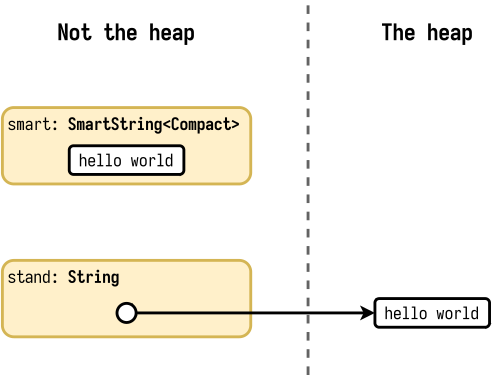
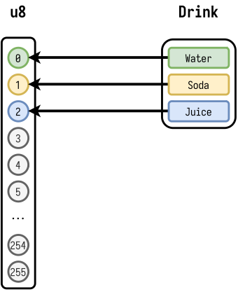

>  本译文译自 [Peeking inside a Rust enum](https://fasterthanli.me/articles/peeking-inside-a-rust-enum)

---


<style>
.dialog {
    display: flex;
    flex-direction: row;
    padding-bottom: 1em;
    overflow: hidden;
}
.dialog p {
    color: black;
}
.dialog a {
    color: #0366d6;
    
}
.dialog.amos {
    flex-direction: row-reverse;
}
.dialog-head {
    align-self: flex-start;
    flex-basis: 48px;
    width: 48px;
    height: 48px;
    margin: 0.2em 0.4em;
    flex-shrink: 0;
}
.dialog-text {
    background-color: #fefdf6;
    border: 1px solid #ffeb81;
    max-width: 600px;
    align-self: flex-start;
    border-radius: 3px;
    padding: 0.4rem 0.8rem;
    overflow: hidden
}
.dialog.amos .dialog-text {
    background-color: #f6f9ff;
    border: 1px solid #cce3f9;
}
.tip {
    line-height: 1.6;
    border-radius: 4px;
    padding: 0.4rem 0.8rem;
    background-color: #fefdf6;
    border: 1px solid #ffeb81;
}
.tip .tip-header {
    display: flex;
    align-items: center;
    justify-content: center;
    font-weight: bold;
    margin-top: 0.2em;
    margin-bottom:0.6em;
}
.tip .tip-header img {
    transform: none;
    width: 3rem;
    height: 3rem;
}
</style>
# 前言

在我最近 `Rust Q&A` `twitch` 频道里, 有些人提出了一个看起来简单的问题: 为什么 `small string` 类型, 像 `SmartString` or `SmolStr` 和 `String` 有着一样的大小, 但是 `small vec` 类型, 像 `SmallVec` 却要比 `Vec` 大?

我知道我使用了简单作为形容词, 但是事实上要了解这个问题, 我们需要一些背景知识

> 译者: 亿点点...

## 这个问题到底是什么?

我最近谈到 `Rust` [small string crates](https://fasterthanli.me/articles/small-strings-in-rust).

被这些 `crates` 导出的类型可以避免多次内存分配, 并且降低内存使用量. 让我们看一个 [smartstring](https://lib.rs/crates/smartstring) 的代码作为例子.

```rust
use smartstring::{Compact, SmartString};
use std::mem::size_of_val;

fn main() {
    let smart = SmartString::<Compact>::from("hello world");
    dbg!(size_of_val(&smart));
    let stand = String::from("hello world");
    dbg!(size_of_val(&stand));
}
```

```shell
$ cargo run -q
[src/main.rs:6] size_of_val(&smart) = 24
[src/main.rs:9] size_of_val(&stand) = 24
```

正如你看到的, 同样也是最初的问题描述的那样, 这两个类型的大小是相同的.

<div class="dialog">
    
    <div class="dialog-text">
    <p>毫无疑问的, `String` 存储实际数据是在别的地方? 因为所有 `String` 类型值的大小在64位平台上都是24个字节.</p>
    </div>
</div>


是的, 这当然不是一个完整的故事, 在这个特别的例子中, `smart` 以 `inline` 的方式存储它的值(在栈上), 而标准库将值存储在堆上:



如果我们想知道每个类型到底总共使用了多少内存, 我们可以这样做:

```rust
    let smart = SmartString::<Compact>::from("hello world");
    dbg!(size_of_val(&smart));

    let stand = String::from("hello world");
    dbg!(size_of_val(&stand) + stand.capacity());
```

```shell
$ cargo run -q
[src/main.rs:6] size_of_val(&smart) = 24
[src/main.rs:9] size_of_val(&stand) + stand.capacity() = 35
```

<div class="dialog">
    
    <div class="dialog-text">
        <p>好吧, 但是 - 你说 <code>String</code> 显而易见在堆中存放它的内容. 有什么方法可以正式这个说法么?
        </p>
    </div>
</div>

<div class="dialog amos">
    
    <div class="dialog-text">
        <p>当然有!</p>
    </div>
</div>

典型的, 在 `Linux 64-bit` 系统中栈和堆在虚拟地址中的空间相差很远, 这意味着我们如果打印字符串的元数据的地址和内容的地址, 我们就可以看到:
* `SmartString` 的元数据和内容在相邻的位置.
* `String` 的元数据和内容相距很远.

```rust
use smartstring::{Compact, SmartString};

fn main() {
    let smart = SmartString::<Compact>::from("hello world");
    let smart_meta = &smart as *const _;
    let smart_data = &smart.as_bytes()[0] as *const _;
    dbg!((smart_meta, smart_data));

    let stand = String::from("hello world");
    let stand_meta = &stand as *const _;
    let stand_data = &stand.as_bytes()[0] as *const _;
    dbg!((stand_meta, stand_data));
}
```

```shell
$ cargo run -q
[src/main.rs:7] (smart_meta, smart_data) = (
    0x00007ffce4cf4728,
    0x00007ffce4cf4729,
)
[src/main.rs:12] (stand_meta, stand_data) = (
    0x00007ffce4cf47f8,
    0x0000555f87686a60,
)
```


<div class="dialog">
    
    <div class="dialog-text">
        <p>好吧, 我信了. 那么 <code>smart</code> 总是把它的数据存储在栈中吗?</p>
    </div>
</div>

不! 只有在小于24字节的时候是存储在栈上的, 就和 `String` 一样. 我们用稍微长一点的字符串来看看.

```rust
use smartstring::{Compact, SmartString};

fn main() {
    let input = "Turns out you can blame your tools *and* be a good craftsperson. Who knew?";

    let smart = SmartString::<Compact>::from(input);
    let smart_meta = &smart as *const _;
    let smart_data = &smart.as_bytes()[0] as *const _;
    dbg!((smart_meta, smart_data));

    let stand = String::from(input);
    let stand_meta = &stand as *const _;
    let stand_data = &stand.as_bytes()[0] as *const _;
    dbg!((stand_meta, stand_data));
}
```

```shell
$ cargo run -q
[src/main.rs:9] (smart_meta, smart_data) = (
    0x00007ffd460d0268,
    0x0000555f4636ca30,
)
[src/main.rs:14] (stand_meta, stand_data) = (
    0x00007ffd460d0338,
    0x0000555f4636cac0,
)
```

...然后我们就可以看到这两个类型的内容现在都放在堆上了.

<div class="dialog">
    
    <div class="dialog-text">
        <p>这样, 那 <code>SmartString</code> 是否意味着买一送一的处理方式? 这和他的类型有关?</p>
        <br/>
        <p>它是怎么工作的?</p>
    </div>
</div>

<div class="dialog amos">
    
    <div class="dialog-text">
        <p>多么好的一个问题. 让我们谈谈枚举</p>
    </div>
</div>


## 一个单词, 多种意义

如果你有着 `C/C++/Java/C#` 的语言背景, 一个 `enum` 仅仅意味着一个 `Integer` 类型, 只是它的值有着自己的意义.

让我们看一个 `C` 的例子:

```c
#include <stdio.h>

enum Drink {
    Water,
    Soda,
    Juice,
};

int main() {
    enum Drink dri = Soda;
    printf("dri = %d\n", dri);
    printf("sizeof(dri) = %ld\n", sizeof(dri));
    printf("sizeof(int) = %ld\n", sizeof(int));
}
```

这里, 我们声明了一个枚举类型 `enum Drink`, 有三个变体, 不过仅仅是从0开始的数字, 所以我们有 `Water = 0`, `Soda = 1`, `Juice = 2`:

```shell
$ clang -Wall main.c -o main && ./main
dri = 1
sizeof(dri) = 4
sizeof(int) = 4
```

然而我不是很喜欢这个代码, 我不想要额外的限定词, 并且想要我的变体有着自己的命名空间, 但在 `C` 里面我们需要自己做这些事:

```c
#include <stdio.h>

// this could also be done in two separate declarations
typedef enum Drink {
    Drink_Water,
    Drink_Soda,
    Drink_Juice,
} Drink;

int main() {
    Drink dri = Drink_Soda;
    printf("dri = %d\n", dri);
    printf("sizeof(dri) = %ld\n", sizeof(dri));
    printf("sizeof(int) = %ld\n", sizeof(int));
}
```

Ahhh, 好多了. 但是这里仍然有其它的东西我不是特别喜欢, 像是 `C` 的 `switch`. 下面的代码是错误的:
```c
#include <stdio.h>

typedef enum Drink {
    Drink_Water,
    Drink_Soda,
    Drink_Juice,
} Drink;

void print_drink(Drink dri) {
    switch (dri) {
        case Drink_Water:
            printf("It's water!\n");
        case Drink_Soda:
            printf("It's soda!\n");
        case Drink_Juice:
            printf("It's juice!\n");
    }
}

int main() {
    print_drink(Drink_Soda);
}
```

正确的代码是在每个 `case` 语句的结尾都使用 `break`. 这是刚起步的开发人员很早就应该了解的事情之一.

<div class="tip">
    <div class="tip-header">
        
        Cool bear's hot tip
    </div>
    鹅妹子嘤, 在 `C#` 中是强制要求在每个非空的 <code>case</code> 中添加 <code>break</code> 否则不能编译通过, 这防止你硬编码错误而导致的隐式跌落(意思是没有 <code>break</code> 的情况就一个 <code>case</code> 一个 <code>case</code> 向下运行), 如果喜欢的话你仍然可以实现一个 <a href="https://stackoverflow.com/questions/174155/switch-statement-fallthrough-in-c/174223#174223">明确的跌落</a>.
</div>

即使我们修复了 `switch` 的问题, 还有件我不喜欢 `C` 枚举的事情, 那就是没什么可以阻止我传递一个无意义的值:

```c
#include <stdio.h>

typedef enum Drink {
    Drink_Water,
    Drink_Soda,
    Drink_Juice,
} Drink;

void print_drink(Drink dri) {
    switch (dri) {
        case Drink_Water:
            printf("It's water!\n");
            break;
        case Drink_Soda:
            printf("It's soda!\n");
            break;
        case Drink_Juice:
            printf("It's juice!\n");
            break;
    }
}

int main() {
    print_drink(47);
}
```

```shell
$ clang -Wall main.c -o main && ./main
```

现在, 如果我们看看 `Rust` 的枚举... 这是个完全不同的事情.

让我们尽量写一个相同的程序.

```rust
use std::mem::size_of_val;

enum Drink {
    Water,
    Soda,
    Juice,
}

fn main() {
    let dri = Drink::Water;
    dbg!(size_of_val(&dri));
    dbg!(dri as u32);
}
```

```shell
$ cargo run -q
warning: variant is never constructed: `Soda`
 --> src/main.rs:5:5
  |
5 |     Soda,
  |     ^^^^
  |
  = note: `#[warn(dead_code)]` on by default

warning: variant is never constructed: `Juice`
 --> src/main.rs:6:5
  |
6 |     Juice,
  |     ^^^^^

warning: 2 warnings emitted

[src/main.rs:11] size_of_val(&dri) = 1
[src/main.rs:12] dri as u32 = 0
```

那么我们明显地得到了什么好处呢?


<div class="dialog">
    
    <div class="dialog-text">
        <p>让我看看, 这看起来像是一个 <code>Integer</code> 类型 - 至少, 我能把它转型为一个 <code>u32</code>. 但是它默认就有命名空间?</p>
    </div>
</div>

对的, 但那并不是全部! 编译器警告我们有没有使用的变体, 并且我们可以简单地给这个枚举派生一个 `Debug` trait 的实现:

```rust
#[derive(Debug)]
enum Drink {
    Water,
    Soda,
    Juice,
}

fn main() {
    print_drink(&Drink::Water);
    print_drink(&Drink::Juice);
    print_drink(&Drink::Soda);
}

fn print_drink(dri: &Drink) {
    println!("{:?}", dri);
}
```

```shell
$ cargo run -q
Water
Juice
Soda
```

...并且假如我们不那么做, 我们也能使用 `match` 而不是 `switch`, `match` 会检查是否匹配了枚举的所有变体, 举个例子, 下面的代码不能通过编译:

```rust
fn print_drink(dri: &Drink) {
    match dri {
        Drink::Water => println!("it's water!"),
        Drink::Soda => println!("it's soda!"),
    }
}
```

```shell
$ cargo run -q
error[E0004]: non-exhaustive patterns: `&Juice` not covered
  --> src/main.rs:15:11
   |
2  | / enum Drink {
3  | |     Water,
4  | |     Soda,
5  | |     Juice,
   | |     ----- not covered
6  | | }
   | |_- `Drink` defined here
...
15 |       match dri {
   |             ^^^ pattern `&Juice` not covered
   |
   = help: ensure that all possible cases are being handled, possibly by adding wildcards or more match arms
   = note: the matched value is of type `&Drink`
```

编译器给出了两种可能的方法来修复这个问题, 或是添加一个通配符:

```rust
fn print_drink(dri: &Drink) {
    match dri {
        Drink::Water => println!("it's water!"),
        Drink::Soda => println!("it's soda!"),
        _ => println!("it's something we don't know about!"),
    }
}
```

或者是覆盖到所有的情况:

```rust
fn print_drink(dri: &Drink) {
    match dri {
        Drink::Water => println!("it's water!"),
        Drink::Soda => println!("it's soda!"),
        Drink::Juice => println!("it's juice!"),
    }
}
```

<div class="tip">
    <div class="tip-header">
        
        Cool bear's hot tip
    </div>
    这听起来是不是要敲很多代码? 幸运的是, <code>rust-analyzer</code> 可以帮忙补全 <code>case</code>, 这帮我们自动生成的很大一部分代码.
</div>

讲到 `match`, 它也是一个表达式, 所以我们也可以这么做:

```rust
fn print_drink(dri: &Drink) {
    println!(
        "{}",
        match dri {
            Drink::Water => "it's water!",
            Drink::Soda => "it's soda!",
            Drink::Juice => "it's juice!",
        }
    )
}
```

尽管就我个人而言, 我可能更倾向于这样写:

```rust
fn print_drink(dri: &Drink) {
    let name = match dri {
        Drink::Water => "water",
        Drink::Soda => "soda",
        Drink::Juice => "juice",
    };
    println!("it's {}!", name)
}
```

让我们想想, 我们还抱怨了 `C` 枚举的什么地方?

<div class="dialog">
    
    <div class="dialog-text">
        <p>你可以传递无意义的值!</p>
    </div>
</div>

对! 让我们试试:

```rust
fn main() {
    print_drink(&Drink::Water);
    print_drink(&Drink::Juice);
    print_drink(&Drink::Soda);

    let val: Drink = 4 as Drink;
    print_drink(&val);
}
```

```shell
$ cargo run -q
error[E0605]: non-primitive cast: `i32` as `Drink`
  --> src/main.rs:13:22
   |
13 |     let val: Drink = 4 as Drink;
   |                      ^^^^^^^^^^
   |
   = note: an `as` expression can only be used to convert between primitive types. Consider using the `From` traitt
```

Ah, 这看起来并不能工作! 然而在某些情形中我们可能需要这么做, 我们可以解析一个二进制格式, 并且已经确保检查这个数字类型的值在这个枚举中是有意义的 - 那么我们可以使用 `transmute`:

```rust
#[allow(dead_code)]
enum Drink {
    Water,
    Soda,
    Juice,
}

fn main() {
    let juice_from_binary_format = 2;

    let val: Drink = unsafe { std::mem::transmute(juice_from_binary_format as u8) };
    print_drink(&val);
}

fn print_drink(dri: &Drink) {
    let name = match dri {
        Drink::Water => "water",
        Drink::Soda => "soda",
        Drink::Juice => "juice",
    };
    println!("it's {}!", name)
}
```

```shell
$ cargo run -q
it\'s juice!
```

当前, 通常我们希望给这个不安全操作提供一个安全的接口:

```rust
use std::convert::{TryFrom, TryInto};

#[allow(dead_code)]
enum Drink {
    Water,
    Soda,
    Juice,
}

impl TryFrom<i32> for Drink {
    type Error = &'static str;

    fn try_from(x: i32) -> Result<Self, Self::Error> {
        match x {
            0..=2 => Ok(unsafe { std::mem::transmute(x as u8) }),
            _ => Err("invalid Drink value"),
        }
    }
}

fn main() {
    let juice_from_binary_format: i32 = 2;
    let val: Drink = juice_from_binary_format.try_into().unwrap();
    print_drink(&val);

    let invalid_value: i32 = 4;
    let val: Drink = invalid_value.try_into().unwrap();
    print_drink(&val);
}
```

```shell
$ cargo run -q
it\'s juice!
thread 'main' panicked at 'called `Result::unwrap()` on an `Err` value: "invalid Drink value"', src/main.rs:27:22
note: run with `RUST_BACKTRACE=1` environment variable to display a backtrace
```

并且我们的快乐还并不止步于此.

还记得我们之前打印我们的枚举大小么? 让我们来 [refresh out memory](https://en.wikipedia.org/wiki/Memory_refresh):

```rust
use std::mem::size_of;

#[allow(dead_code)]
enum Drink {
    Water,
    Soda,
    Juice,
}

fn main() {
    dbg!(size_of::<Drink>());
}
```

```shell
$ cargo run -q
[src/main.rs:11] size_of::<Drink>() = 1
```

单位是字节, 所以这里显示我们的枚举只有一个字节.

让我们与 `C` 的对比下:

```c
#include <stdio.h>

typedef enum Drink {
    Drink_Water,
    Drink_Soda,
    Drink_Juice,
} Drink;

int main() {
    printf("sizeof(Drink) = %ld\n", sizeof(Drink));
}
```

```shell
$ clang -Wall main.c -o main && ./main
sizeof(Drink) = 4
```

这里枚举有足足4个字节, 所以我们可以近似地说 `Rust` 的枚举是 `u8`, `C` 枚举是 `u32`.

如果 `Rust` 的枚举超过256个变体呢?

```rust
use std::mem::size_of;

#[allow(dead_code)]
enum Drink {
    Variant0,
    Variant1,
    Variant2,
    Variant3,
    Variant4,
    // (etc.)
    Variant252,
    Variant253,
    Variant254,
    Variant255,
    Variant256,
}

fn main() {
    dbg!(size_of::<Drink>());
}
```

<div class="dialog">
    
    <div class="dialog-text">
        <p>等等, 这里只有256个变体?</p>
    </div>
</div>

<div class="dialog amos">
    
    <div class="dialog-text">
        <p>Nice try cool bear, but no! <a href="https://en.wikipedia.org/wiki/Off-by-one_error#Fencepost_error">你只是在数栅栏中的格子, 你应该数标杆</a>.</p>
    </div>
</div>

> 译者: [counting the fences, when you should be counting the posts.](https://en.wikipedia.org/wiki/Off-by-one_error#Fencepost_error)

不管怎样, 我们先看看现在的枚举大小?

```shell
$ cargo run -q
[src/main.rs:265] size_of::<Drink>() = 2
```

2个字节! 看起来又像是 `u16`.

当然看起来像并不是一个专业术语 - 专业术语应该是 "representation". 一个 `Rust` 枚举是对特定整数类型的抽象.

让我们看看我们原来的 `Drink`:



概念上, `Drink` 只有三个有意义的值, 但是它的表现是一个 `u8`, 能持有256个不同的值. 这就是你为什么总是能把 `Drink` 转为 `u8`, 但是把 `u8` 转为 `Drink` 却是一个容易出错的操作.

<div class="dialog">
    
    <div class="dialog-text">
        <p>因此使用 <code>TryFrom/TryInto</code> 而不是 <code>From/Into</code></p>
    </div>
</div>

对的! 潜在的 `Drink` 作为一个 `u8` 应该总是为0, 1或者2, 这被称为不变体(invariant). 如果我们破坏了这个不变体, 我们的代码就不是那么健壮了.

在 `Rust`, 破坏不变体需要使用 `unsafe` 代码:

```rust
use std::mem::transmute;

#[allow(dead_code)]
#[derive(Debug, PartialEq)]
enum Drink {
    Water,
    Soda,
    Juice,
}

fn main() {
    // woops! that's unsound.
    let d: Drink = unsafe { transmute(15_u8) };
    dbg!(&d);
    dbg!(d == Drink::Juice);
}
```

```shell
$ cargo run -q
[src/main.rs:14] &d = Juice
[src/main.rs:15] d == Drink::Juice = false
```

<div class="dialog">
    
    <div class="dialog-text">
        <p>这太糟了 - 但是你没法意外的通过安全代码来获取一个无效的枚举值不是吗?</p>
    </div>
</div>

<div class="dialog amos">
    
    <div class="dialog-text">
        <p>对的, <code>unsafe</code>关键字将一个区域标记为更少的约束, 所以在代码审查中要对有潜在危险的代码格外注意.</p>
    </div>
</div>

<div class="dialog">
    
    <div class="dialog-text">
        <p>听起来很糟. 是不是意味着有 <code>unsafe</code> 的代码就很糟糕呢?</p>
    </div>
</div>

<div class="dialog amos">
    
    <div class="dialog-text">
        <p>有时候是不可避免的. 但是仅仅是有时候! 库作者通常会发现他们并不是真的需要 <code>unsafe</code> 来做他们想做的事情, 他们可以把那些替换成安全的代码 - 这使得只有更少的区域需要去重点关注.</p>
    </div>
</div>

<div class="dialog">
    
    <div class="dialog-text">
        <p>不能使语言本身完全没有 <code>unsafe</code> 代码吗?</p>
    </div>
</div>

<div class="dialog amos">
    
    <div class="dialog-text">
        <p>完全不要 <code>unsafe</code> 代码是一个比较大的话题, 但是当然需要更少的不安全代码. 举个例子, 有一个为了 <a href="https://github.com/rust-lang/project-safe-transmute">safe(r) transmute</a> 的工作小组.</p>
    </div>
</div>

问题的关键在于不是所有的事情都可以交由计算机去做(意味着需要你自己去做), 可以使用 `Rust` 的模型检查. 因为种种原因, 你仍然需要 `unsafe` 代码.

这并不意味有着两种 `Rust`, 仅仅意味着不同的风险以及不同的可信任等级.

如果你相信 `Rust` 核心团队可以根除标准库中的不健全之处, 那么你甚至就可以让团队中的初级人员在此基础上编写受 `Rust` 安全保证的 `safe code`.


## Rust枚举不止于此

Cool bear早先说 `SmartString` 有着买一送一的处理字符串的方式. Cool bear是对的!

让我们来自己做一个 `two-for-one` 的处理方式:

```rust
enum UserID {
    Number(u64),
    Text(String),
}
```

`UserID` 是一个合体类型, 一个 `UserID` 的值可以是一个 `UserID::Number` 变体, 或是一个 `UserID::Text` 变体.如果我们想对它的内容做些操作, 我们需要用模式匹配:

```rust
fn print_user_id(id: &UserID) {
    match id {
        UserID::Number(n) => {
            println!("user id number {}", n);
        }
        UserID::Text(s) => println!("user id {}", s),
    }
}
```

希望你对这个用法很熟悉, 我们在不久前刚提到过这个用法.

让我们进行一次打印操作:

```rust
fn main() {
    print_user_id(&UserID::Number(79));
    print_user_id(&UserID::Text("fh99a73gbh8".into()));
}
```

```shell
$ cargo run -q
user id number 79
user id fh99a73gbh8
```